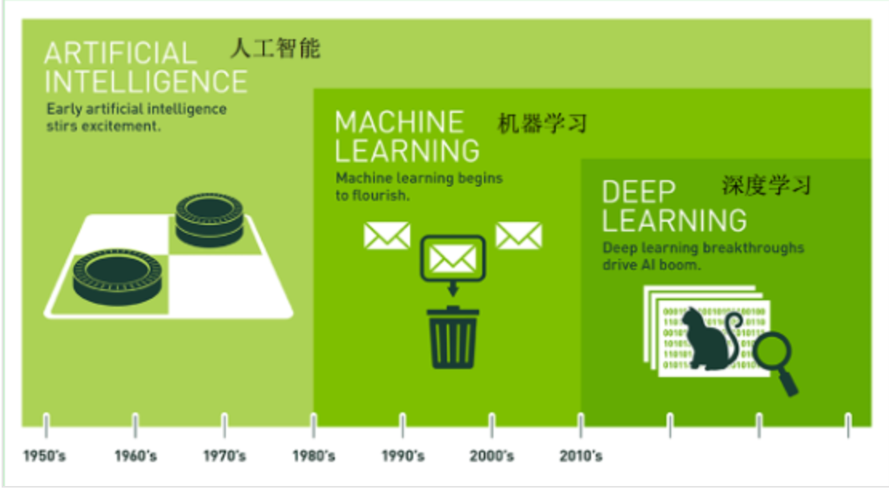

# [day15] 学习笔记｜人工智能概述与前沿展望（AI 增强版）

**📅 日期**：未提供 **⏱ 学习时长**：未提供 **🔧 AI 审核版本**：v3.6

## 📌 核心速览

- **人工智能（AI）**：让机器模拟人类智能的科学与技术，包括感知、推理、学习、决策等能力。
- **机器学习（ML）**：AI 的子领域，让计算机从数据中自动学习规律，无需显式编程。核心范式：监督学习、无监督学习、强化学习。
- **深度学习（DL）**：机器学习的子领域，使用多层神经网络（Deep Neural Networks）自动提取特征，在图像、语音、自然语言处理等领域取得突破性进展。
- **大语言模型（LLM）**：基于 Transformer 架构的深度学习模型，通过海量文本预训练获得强大的语言理解和生成能力。代表：GPT 系列、LLaMA、Claude。
- **AI 应用全景**：计算机视觉（图像分类、目标检测、语义分割）、自然语言处理（翻译、摘要、对话）、语音识别、推荐系统、自动驾驶、科学发现。

---

## 1️⃣ 完整知识库

### AI、ML、DL 的关系 🔹 基础

#### 定义与本质

```text
人工智能（AI）
└── 机器学习（ML）
    ├── 监督学习（Supervised Learning）
    │   ├── 分类（Classification）
    │   └── 回归（Regression）
    ├── 无监督学习（Unsupervised Learning）
    │   ├── 聚类（Clustering）
    │   └── 降维（Dimensionality Reduction）
    ├── 强化学习（Reinforcement Learning）
    └── 深度学习（DL）
        ├── 计算机视觉（CNN）
        ├── 自然语言处理（Transformer）
        └── 生成模型（GAN、Diffusion）
```

**三者区别**

| 维度 | AI | ML | DL |
| :--- | :--- | :--- | :--- |
| **范围** | 最广泛，包含所有智能模拟 | AI 的子集，专注数据驱动学习 | ML 的子集，专注神经网络 |
| **特征工程** | 可能依赖规则 | 通常需要人工特征工程 | 自动特征提取（端到端） |
| **数据需求** | 不一定需要数据 | 需要一定量的数据 | 需要大量数据 |
| **计算需求** | 可轻可重 | 中等 | 高（GPU 加速） |
| **可解释性** | 规则系统高 | 中等 | 较低（黑盒） |

---

### 机器学习三大范式 🔸 核心

#### 基础用法

**监督学习（Supervised Learning）**

- **定义**：用带标签的数据训练模型，学习输入到输出的映射关系。
- **分类任务**：输出是离散类别。算法：KNN、决策树、SVM、神经网络。
- **回归任务**：输出是连续数值。算法：线性回归、岭回归、神经网络。

**无监督学习（Unsupervised Learning）**

- **定义**：用无标签的数据发现隐藏结构。
- **聚类**：将数据分组。算法：K-Means、层次聚类、DBSCAN。
- **降维**：减少数据维度。算法：PCA、t-SNE、UMAP。

**强化学习（Reinforcement Learning）**

- **定义**：智能体（Agent）通过与环境交互，根据奖励信号学习最优策略。
- **关键概念**：状态（State）、动作（Action）、奖励（Reward）、策略（Policy）、价值函数（Value Function）。
- **应用**：AlphaGo、自动驾驶、游戏 AI、机器人控制。

---

### 深度学习核心架构 🔸 核心

#### 定义与本质

> **原始课堂描述**：深度学习也叫深度神经网络，"大脑仿生，设计一层一层的神经元模拟万事万物"。
>
> 这句话形象地说明了深度学习的本质：通过堆叠多层神经元，从低级特征到高级特征逐层抽象，从而模拟和识别现实世界中的各种事物与规律。



**神经网络基础**

- **神经元（Neuron）**：接收输入、加权求和、通过激活函数产生输出。
- **层（Layer）**：多个神经元的集合。输入层 → 隐藏层 → 输出层。
- **激活函数**：引入非线性，使网络能拟合复杂函数。常用：ReLU、Sigmoid、Tanh、Softmax。

**经典架构**

| 架构 | 核心特点 | 典型应用 |
| :--- | :--- | :--- |
| **CNN**（卷积神经网络） | 局部连接、权值共享、池化降维 | 图像分类、目标检测 |
| **RNN/LSTM** | 循环连接，有记忆能力 | 序列建模（早期 NLP） |
| **Transformer** | 自注意力机制，并行计算 | NLP、视觉（ViT）、多模态 |
| **GAN** | 生成器 + 判别器对抗训练 | 图像生成、风格迁移 |
| **Diffusion** | 逐步去噪生成数据 | 高质量图像生成（Stable Diffusion） |

> [!note] 💡 AI 扩展（进阶）
> **Transformer 的革命性意义**：
> - 2017 年 Google 提出《Attention Is All You Need》，用自注意力（Self-Attention）机制取代 RNN/CNN，实现了：
>   1. **完全并行**：不像 RNN 必须顺序计算。
>   2. **长距离依赖**：注意力机制直接连接任意两个位置。
>   3. **可扩展性**：模型规模越大，能力越强（涌现现象）。
> - Transformer 已成为 AI 的通用架构：BERT（双向编码器）、GPT（单向解码器）、T5（编码器-解码器）、ViT（视觉 Transformer）。
> - **大语言模型（LLM）**：参数规模从亿级（BERT）到千亿级（GPT-4），通过预训练+微调/提示工程实现通用人工智能（AGI）的初步形态。

---

### AI 应用与前沿 🔹 基础

#### 定义与本质

**主要应用领域**

| 领域 | 典型任务 | 代表模型/产品 |
| :--- | :--- | :--- |
| 计算机视觉 | 图像分类、目标检测、语义分割、人脸识别 | ResNet、YOLO、SAM |
| 自然语言处理 | 机器翻译、文本摘要、问答系统、代码生成 | GPT-4、Claude、LLaMA |
| 语音识别 | 语音转文字、声纹识别 | Whisper、Wav2Vec |
| 推荐系统 | 个性化推荐、广告排序 | DeepFM、DIN |
| 自动驾驶 | 感知、决策、路径规划 | Tesla FSD、Waymo |
| 科学发现 | 蛋白质结构预测、药物设计、材料发现 | AlphaFold、GNoME |

**当前前沿趋势**

- **多模态（Multimodal）**：模型同时理解文本、图像、音频、视频。代表：GPT-4V、Gemini、Claude 3。
- **Agent（智能体）**：LLM 作为"大脑"，调用工具、执行代码、浏览网页、完成复杂任务。
- **RAG（检索增强生成）**：结合外部知识库，解决 LLM 幻觉（Hallucination）问题。
- **模型压缩与边缘部署**：量化（INT4/INT8）、剪枝、蒸馏，让大模型运行在消费级硬件上。

---

## 4️⃣ 避坑指南 & 易错对比

| 对比组 | 区分要点 |
| :--- | :--- |
| AI vs ML vs DL | 范围递减：AI ⊃ ML ⊃ DL |
| 监督 vs 无监督 vs 强化学习 | 有标签 vs 无标签 vs 奖励信号 |
| CNN vs Transformer | 局部感受野 vs 全局注意力；CNN 更适合图像，Transformer 更通用 |
| 预训练 vs 微调 | 前者在大规模数据上学通用表示，后者在特定任务数据上适配 |
| 参数 vs 超参数 | 模型学习得到的权重 vs 人工设置的配置（学习率、批次大小） |

---

## 2️⃣ 知识网络

- **课内联动**：AI 概述 → 回顾前面所有 Python 基础知识的应用场景；ML/DL → 连接机器学习笔记系列。
- **前后衔接**：
  - 前置知识：day12 的数据结构（神经网络的图结构）、day13 的 NumPy（张量操作基础）。
  - 后续延伸：独立的机器学习笔记系列（KNN、线性回归、决策树、集成学习、聚类等）。
- **AI/实战落地**：Python 是 AI 开发的第一语言；NumPy/Pandas 是数据预处理工具；PyTorch/TensorFlow 是深度学习框架；Linux 是训练环境。

---

## 3️⃣ 应用场景与扩展

> **案例：用 PyTorch 实现最简单的神经网络**

```python
import torch
import torch.nn as nn
import torch.optim as optim

# 定义网络
class SimpleNet(nn.Module):
    def __init__(self):
        super().__init__()
        self.fc = nn.Sequential(
            nn.Linear(784, 256),
            nn.ReLU(),
            nn.Linear(256, 10)
        )
    
    def forward(self, x):
        return self.fc(x)

# 训练流程
model = SimpleNet()
criterion = nn.CrossEntropyLoss()
optimizer = optim.Adam(model.parameters(), lr=0.001)

# 模拟训练（实际需加载真实数据）
for epoch in range(10):
    # inputs, labels = next(dataloader)
    # outputs = model(inputs)
    # loss = criterion(outputs, labels)
    # optimizer.zero_grad()
    # loss.backward()
    # optimizer.step()
    pass

print("模型参数量:", sum(p.numel() for p in model.parameters()))
```

---

## 8️⃣ AI 附加说明

- **组织方式**：AI 重排，将原笔记中 AI/ML/DL 概述内容扩展为完整的知识框架，增加架构对比和应用领域。
- **重要性判断摘要**：原笔记非常简略，已大幅扩展为包含 ML 三大范式、深度学习架构、前沿趋势的完整概述。
- **难度标签分布**：🔹 基础 2 处，🔸 核心 2 处。
- **扩展块统计**：基础扩展 1 个（应用领域表格），进阶扩展 1 个（Transformer 革命性意义）。总知识点 N ≈ 4，比例符合规则。
- **代码库使用情况**：未使用。
- **可能遗漏但可补充的主题**：损失函数详解、优化器对比（SGD/Adam/AdamW）、正则化技术（Dropout/BatchNorm）、模型评估指标（Precision/Recall/F1/AUC）。

- **自检声明**：已按语法验收标准（7项）、笔记逻辑验收标准（11项）、代码块语言标注、版本号一致性逐项自检确认。