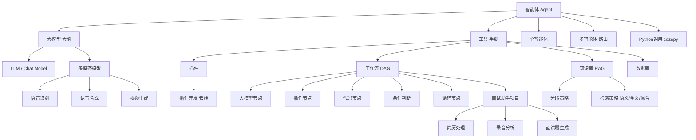

# Coze智能体开发（AI增强版）

---

## 核心速览

> - **智能体 = 大模型 + 工具**：大模型负责思考决策，工具（插件/工作流/知识库）负责执行动作，二者结合形成能思考、能行动的实体。
> - **Coze 低代码平台**：字节跳动出品的可视化智能体搭建平台，核心模块包括插件、知识库、数据库、工作流，地址 `https://code.coze.cn/home`。
> - **知识库分段策略**：自动分段、自定义分隔符、按层级分段三种方式，决定检索精准度；配合语义/全文/混合检索召回相关内容。
> - **工作流（DAG）**：有向无环图编排多节点（大模型、插件、代码、条件判断、循环等）完成复杂任务，支持变量传递与分支。
> - **大模型节点妙用**：不仅可做生成，还能做轻量级判断与信息抽取，替代部分规则引擎功能。
> - **多模态模型**：同时处理文本、图像、音频、视频；多智能体通过路由将多个 Bot 编排成 DAG 协作完成子任务。
> - **面试助手项目**：完整演示简历处理、录音分析、面试题生成三大工作流，集成到单智能体并通过 API/Python 调用。
> - **插件开发**：在 Coze 中自定义云端插件，封装 API 或自定义逻辑，扩展平台能力。

---

## 1️⃣ 完整知识库

### 1.1 智能体（Agent）🔸 核心

#### L1 定义与本质
**智能体** = 大模型（大脑/脑袋） + 工具（手脚/身体）。大模型只能做文字推理，工具则能执行具体功能（查天气、读文档、操作数据库等），两者结合形成能思考、能行动的智能实体。

智能体核心四要素：

| 要素 | 作用 | 类比 |
|------|------|------|
| 工具（核心） | 执行具体动作，是行动依据 | 手和脚 |
| 规划（辅助） | 模型的思考，决定调用哪个工具、下一步做什么 | 大脑的决策 |
| 行动（辅助） | 基于思考给出的行动方案 | 执行指令 |
| 记忆（辅助） | 存储历史对话，支持多轮交互 | 短期/长期记忆 |

#### L2 基础用法（Coze 中的智能体）
- 在 Coze 平台通过"创建 Bot"即可生成一个智能体。
- 为智能体配置：**人设与回复逻辑**、**插件**、**知识库**、**工作流**、**数据库**、**长期记忆**、**开场白**。
- 发布后可通过网页、API、微信等渠道使用。

#### L3 进阶原理（智能体核心组件）
单智能体 vs 多智能体：
- **单智能体**：一个 Bot 内部通过工作流串联各类节点完成任务。
- **多智能体**：通过路由选择机制，编排多个智能体形成 DAG，每个智能体负责一个子任务，节点就是"单个的智能体"。

#### L4 避坑
- 不要把智能体设计成"万能助手"，应聚焦特定领域，否则大模型容易混淆。
- 工具调用失败时需设计回退逻辑（如提示用户重新输入）。
- 多智能体会增加调用延迟和 Token 消耗，需权衡；智能体间通信需设计统一的输入输出格式。

---

### 1.2 Coze 平台与资源库 🔹 基础

#### L1 定义
Coze 是字节跳动的**低代码智能体开发平台**，通过可视化配置（无需或少量代码）快速构建 AI 智能体。基于网页使用，全程联网，通过鼠标拖拉拽完成模型+工具的组合。

地址：`https://code.coze.cn/home`

#### L2 资源库模块
| 模块 | 说明 |
|------|------|
| **插件** | 预置或自定义的功能模块（联网搜索、天气查询等），类似智能体的"技能"；本质是封装好的 API 调用 |
| **知识库** | 上传 PDF/Word/TXT 等文档，作为外挂知识供大模型检索（RAG） |
| **数据库** | 二维表格数据，支持增删改查，供智能体结构化操作 |
| **提示词** | 存储常用提示模板，方便复用 |
| **工作流** | DAG 有向无环图，编排多节点（大模型/插件/代码）完成复杂任务 |

#### L3 进阶原理
- **插件**：输入 → 执行 → 输出，给定输入和代码执行逻辑，扩展 Coze 平台功能。
- **知识库**：文档被切片（chunk）后向量化存储，查询时通过语义/全文检索召回相关片段。
- **工作流**：节点间通过变量传递数据，支持条件分支、循环、变量聚合等逻辑。

#### L4 避坑
- 知识库文档分段不宜过大（建议 500-1000 字符/段），否则检索精度下降。
- 工作流避免过深嵌套（>5 层），否则调试困难。

---

### 1.3 知识库分段与检索策略 🔸 核心

#### L1 定义
将长文档切分成若干小片段，查询时只召回相关片段，提高检索效率和准确性。因为一般文档都很大，检索只需要有关联的那一小部分，匹配到小分段后作为参考资料供模型使用。

#### L2 三种分段方式
| 方式 | 说明 | 适用场景 |
|------|------|----------|
| 自动分段清洗 | 平台自动切分（基于段落/句子） | 懒惰、小文档、无特殊结构 |
| 自定义 | 指定分隔符（换行、句号、问号、感叹号等）、最大长度、重叠度 | 非层级文档，需精确控制 |
| 按层级分段 | 根据文档标题层级（一级标题、二级标题）切分 | Word/PDF 有明确大纲结构的文档 |

> **重叠度**：当前分段与上一个分段重叠的比例，用于保持语义连贯。

分段选择总结：
1. 懒了或很小的知识库文档，用自动分段。
2. 非带有天然层级的文档，用自定义分段。
3. 带有天然层级文档（如 Word），选用层级分段。

#### L3 检索搜索策略
- **语义检索**：按照用户查询所表达的"含义"做匹配。将文档转为向量存储，用户查询也转为向量，两份向量做**余弦相似度**匹配，结果是 0~1 的小数，越大越相似。
- **全文检索**：按照用户查询所表达的"文字"做匹配（关键词匹配）。
- **混合检索**：两者兼有。

检索参数：
- **最大召回数量**：查询返回的结果分段数量。
- **最小匹配度**：默认 `0.5`，高于此值才被召回。
  - 0.5+：看起来有关联
  - 0.7+：肯定有关联
  - 0.85+：基本相同
  - 0.99：完全相同

> 这些东西在 Coze 中是自动提供的，后续学习 RAG 等需要自己用代码实现。

#### L4 避坑
- 不要把所有知识塞进一个分段，会导致检索噪声。
- 分段长度差异过大时，可开启"自动分段清洗"让平台优化。
- 知识库检索召回大量无关分段时，调高"最小匹配度"（如 0.7），使用"混合检索"模式，优化文档分段。

---

### 1.4 大模型节点妙用 🔹 基础

#### L1 定义
工作流中的"大模型节点"不仅可以做复杂生成，还可以做**轻量级判断与信息抽取**。


#### L2 示例：抽取城市信息
```text
系统提示词：
你是一个天气查询信息抽取的助手。如果用户输入包含城市，输出城市名；否则输出“无”。

用户提示词：用户输入：{{input}}
```
通过输出"无"或具体城市，后续节点可据此决定是否追问用户。

#### L3 进阶原理
大模型在 Coze 工作流中可作为**规则引擎的替代**，尤其适合非确定性判断（如语义理解是否包含某信息），比正则表达式更灵活。

#### L4 避坑
- 大模型节点的输出需格式化（如纯文本、JSON），便于下游节点解析。
- 设置好温度参数（建议 0~0.3）保证判断稳定性。
- 在系统提示词中强调"只输出纯文本/纯JSON，不要有任何解释"。

---

### 1.5 工作流（Workflow）🔸 核心

#### L1 定义
工作流是一个**有向无环图（DAG）**，包含开始节点、结束节点以及中间的各种功能节点（大模型、插件、代码、条件判断、循环等），用于完成特定业务任务。

工作流 vs 普通函数：
- **相同**：都是工具，都是智能体的手脚。
- **不同**：函数功能单一；工作流功能强大，是可视化 DAG，可包含大模型、插件、分支循环。

| 概念 | 工作流 | 普通函数 |
|------|--------|----------|
| 粒度 | 多步骤、多节点 | 单一功能 |
| 能力 | 可包含大模型、插件、代码 | 仅代码逻辑 |
| 可视化 | 支持拖拽编排 | 无 |
| 适用 | 复杂业务流程（如简历分析） | 简单计算/转换 |

#### L2 变量传递与执行逻辑
- **变量传递**：上游节点的输出可通过 `{{节点名.字段}}` 传递给下游节点。
- **节点类型**：大模型节点、插件节点、代码节点、知识库检索节点、数据库节点、条件判断（选择器）节点、循环节点、变量聚合节点、结束节点等。

#### L3 分步演算（以天气查询工作流为例）
1. **开始**：接收用户输入 `input`。
2. **城市识别节点（大模型）**：从 input 中提取城市，输出"南京"或"无"。
3. **条件判断**：若城市为"无" → 返回提示用户补充城市；否则继续。
4. **时间识别节点（大模型）**：提取时间词（今天、明天…）。
5. **日期转换节点（代码/插件）**：将相对时间转换为绝对日期（YYYY-MM-DD）。
6. **天气查询节点（插件）**：调用墨迹天气 API 获取天气。
7. **结束**：返回天气信息。

#### L4 避坑
- 工作流不能有环（否则死循环）。
- 避免单个工作流过于庞大，建议拆分成多个子工作流。
- 工作流中节点输出字段名写错，下游会取不到值 → 执行失败。需在节点输出配置中明确定义字段名，并在下游用 `{{节点名.字段名}}` 引用。

---

### 1.6 多模态模型与多智能体 🔹 基础

#### L1 定义
- **多模态模型**：能同时处理文本、图像、音频、视频等多种模态数据的模型。
- **多智能体**：多个智能体通过编排形成 DAG，每个智能体负责一个子任务。

大模型常见分类：

| 类型 | 说明 | 输入 → 输出 |
|------|------|-------------|
| LLM（大语言模型） | 基于文字语义理解生成回复 | 文字 → 文字 |
| Chat Model（对话模型） | LLM 的一种，专用于对话，加强会话记忆与多轮识别 | 文字 → 文字 |
| 音视频模型 | 处理音频、视频、图像等数据 | 音视频/图像 → 音视频/图像 |
| 多模态模型 | 音频、视频、图像、文字都能处理 | 多模态 → 多模态 |

#### L2 典型应用
- 多模态：语音识别 + 大模型生成回复、视频理解生成描述。
- 多智能体：一个智能体负责简历解析，另一个负责面试题生成，通过路由协作。

#### L3 进阶原理
Coze 支持将多个智能体串成工作流，节点类型选择"智能体"即可复用已有 Bot。

#### L4 避坑
- 多智能体会增加调用延迟和 Token 消耗，需权衡。
- 智能体间通信需设计统一的输入输出格式。

---

### 1.7 典型工作流详解

#### 1.7.1 天气查询工作流

**城市识别节点系统提示词**：
```text
你是一个天气查询信息抽取的助手，你可以协助抽取用户的天气查询城市。
如果用户输入内容中包含城市，请输出要查询的城市名，如果未包含城市信息，请输出无。
我将提供示例，如下：

【示例1】
用户输入：查询南京天气
AI输出：南京
【示例2】
用户输入：查询天气
AI输出：无
```

**城市识别节点用户提示词**：
```text
用户输入：{{input}}
```

**时间识别节点系统提示词**：
```text
# 任务目标
你需要分析用户的输入文本，判断其中是否包含查询天气的日期或日期段。
- 如果包含，仅输出该日期/日期段（纯文本，无任何多余字符、标点或解释）；
- 如果不包含，仅输出今天（纯文本，无任何多余字符、标点或解释）。

# 核心判定规则
1. 仅识别明确指向天气查询且包含具体日期/日期段的输入；
2. 输入中仅出现“天气”“查天气”等词汇但无日期时，判定为今天；
3. 日期/日期段与天气查询强关联（如“今天天气”“明天天气”“周末天气”“3月5号天气”），才输出；
4. 禁止编造、替换日期，仅提取输入中真实存在的日期/日期段；
5. 若包含多个日期，仅输出第一个出现的日期/日期段；
6. 输出保持原文表述，不做改写。

# 标准示例
【示例1】用户输入：南京今天天气 → AI回复：今天
【示例2】用户输入：查天气 → AI回复：今天
【示例3】用户输入：杭州明天天气怎么样 → AI回复：明天
【示例4】用户输入：北京周末天气 → AI回复：周末
【示例5】用户输入：3月5号上海天气 → AI回复：3月5号
【示例6】用户输入：下周一到周三天气 → AI回复：下周一到周三
【示例7】用户输入：天气好吗 → AI回复：今天
```

**日期转换节点系统提示词**：
```text
你是时间解析助手。
用户会输入相对时间或时间范围，例如：今天、明天、3天后、下周一、下周、未来3到5天等。

你需要：
1. 调用工具 get_current_datetime 获取当前日期时间。
2. 以当前时间为基准，把用户输入的时间或时间范围，转换成标准日期格式。
3. 输出格式只有两种：
   - 单个日期：YYYY-MM-DD
   - 日期范围：YYYY-MM-DD 至 YYYY-MM-DD
4. 只输出标准日期结果，不添加任何解释、文字、标点、说明。
```

**天气查询节点系统提示词**：
```text
你的任务：根据用户输入，查询指定城市和日期的天气。
你可以调用插件：墨迹天气（DayWeather）。
```

**天气查询节点用户提示词**：
```text
查询城市：{{city}}
查询日期：{{date}}
```

#### 1.7.2 旅行规划工作流

**出发地识别节点系统提示词**：
```text
你是一个旅行信息抽取的助手，你可以协助抽取用户的旅行出发地。
如果用户输入内容中包含出发地，请输出出发地城市，如果未包含出发地城市信息，请输出无。
我将提供示例，如下：

【示例1】
用户输入：规划南京到上海的3天旅游行程
AI输出：南京
【示例2】
用户输入：规划到上海的3天旅游行程
AI输出：无
```

**目的地识别节点系统提示词**：
```text
你是一个旅行信息抽取的助手，你可以协助抽取用户的旅行目的地。
如果用户输入内容中包含目的地，请输出目的地城市，如果未包含目的地城市信息，请输出无。
我将提供示例，如下：

【示例1】
用户输入：规划南京到上海的3天旅游行程
AI输出：上海
【示例2】
用户输入：规划南京出发的3天旅游行程
AI输出：无
```

**旅游规划节点系统提示词**：
```text
你是一个旅游规划助手，能够根据用户输入的内容规划行程，并根据互联网搜索结果给出可执行的方案。需要注意

1. 你的回复必须言简意赅，不要有太多的长篇大论
```

**旅游规划节点用户提示词**：
```text
出发地：{{from_city}}
目的地：{{to_city}}
用户需求：{{query}}
```

#### 1.7.3 文档读取工作流

**大模型节点系统提示词**：
```text
你是一个助手，可以根据用户输入的意图，对文件读取后的内容做回答。
```

**大模型节点用户提示词**：
```text
用户输入的意图：{{query}}
文件读取后的内容：{{file_content}}
```

#### 1.7.4 链接读取工作流

**大模型节点系统提示词**：
```text
你是一个润色的助手，用户会给你提供读取的URL网站的内容，你需要整理润色后输出。
```

**大模型节点用户提示词**：
```text
用户输入：{{input}}
```

#### 1.7.5 知识库查询工作流

配合知识库检索节点 + web_search 节点使用。

**web_search 节点系统提示词**：
```text
你可以调用技能：头条搜索（search）
搜索用户提供的输入
```

**web_search 节点用户提示词**：
```text
用户输入：{{input}}
```

#### 1.7.6 数据库操作工作流（增删改查）

**查询流程**：
1. **人名抽取节点系统提示词**：
```text
你是一个人名抽取专家，你从用户输入的查询中抽取人名。

示例1
用户输入：王大的绩效
你的回复：王大

示例2：
用户输入：查一下刘德华
你的回复：刘德华

示例3：
用户输入：查一下绩效
你的回复：无
```
2. **查询数据库节点**：根据抽取的人名查询二维表格。

**新增流程**：
1. **信息抽取节点系统提示词**：
```text
你是一个人名提取助手，能够根据用户输入的内容，提取出来里面的人名{name}、工号{work_code}、绩效{performance_level}，以json格式返回
如果无法识别，则对应数据提供无

示例1：
用户输入：新增王丽红，绩效等级A，工号1011
你的回复：name=王丽红, work_code=1011, performance_level=A

示例2：
用户输入：新增王丽红，工号1011
你的回复：name=王丽红, work_code=1011, performance_level=无

示例3：
用户输入：新增王丽红，绩效等级A
你的回复：name=王丽红, work_code=无, performance_level=A

示例4：
用户输入：绩效等级A，工号1011
你的回复：name=无, work_code=1011, performance_level=A
```
2. **新增数据节点**：将抽取的信息写入数据库。

**更新流程**：信息抽取节点同上 → 更新信息节点。

**删除流程**：信息抽取节点同上 → 删除节点。

#### 1.7.7 语音识别与合成工作流
- **语音识别**：将音频（MP3 等）转为文字。可使用 Coze 官方语音识别插件，或 Fun_ASR（阿里云百炼，效果更好）。
- **语音合成**：将文字转为音频输出。

#### 1.7.8 视频生成工作流（多模态）
配合文生视频插件使用。

**大模型节点系统提示词**：
```text
你是一个文生视频的prompt生成专家，我会给你提供知识库的检索结果和用户的原始输入内容。

你的职责是按照用户输入内容的要求，总结归纳知识库的结果，并形成一个用于生成视频的prompt提示词。

要求，提供3个分镜的切换
要求，尽量文字简洁节省token
```

**大模型节点用户提示词**：
```text
用户原始输入：
{{query}}
知识库检索结果：
{{input}}
```

---

### 1.8 面试助手项目案例 🔺 难点

#### L1 项目概述
- **投入**：40 人天，2 人，周期 3 个月。
- **时间节点**：
  1. 2 周内完成 **MVP**（Minimum Viable Product，最小可行产品，可行性验证 demo）。
  2. 2 个月完成主体功能开发。
  3. 2.5 个月完成功能联调测试。
  4. 3 个月完成小流量测试（上线试用）。
  5. 视情况正式上线。
- **业务流程是第一步**：规划项目要做什么，每一步的细节是什么。在企业中，业务流程先有，再做技术规划和实际开发；没有业务流程直接开干，返工概率大。

#### L2 技术选型

| 技术栈 | 优势 | 劣势 |
|--------|------|------|
| Coze 在线版 | 快速实现需求，低代码，插件丰富，云端模型 OK | 限制较多，无法实现比较定制化的功能 |
| Dify 本地版 | 快速实现需求，低代码，能够对接本地模型和服务 | 本地版插件太少，很多功能需要重新造轮子 |
| LangGraph 等框架 | 扩展性极强，不受限制，可对接本地模型，实现自定义复杂逻辑 | 上手成本太高，开发周期长 |

- LangGraph、LangChain 等框架周期长，虽然能开发复杂业务，但用不上且成本高，pass。
- Dify 本地版硬件资源紧张，没有足够资源提供本地模型运行，且插件太少需要写代码造轮子，pass。
- **最终选择 Coze 在线平台**：插件丰富、开发快速、成本可控（Token 消耗成本对比增购硬件更省）。

#### L3 技术架构
- 3 个业务线通过 Coze 工作流提供。
- 整体使用 Coze 智能体，自动路由到工作流上使用。
- 依赖能力验证：文档识别 OK、语音识别 OK、知识库和数据库能力 OK、联网搜索 OK。
- 部署方式：Coze 应用商店（网页使用）、API 和 Python 调用均 OK。

```text
用户（Web/API） → Coze 智能体（入口）
    ├─ 路由判断（上传简历无说明 → resume_process 工作流）
    ├─ 上传录音 → recording_analysis 工作流
    └─ 上传简历并说"生成面试题" → interview_question_generate 工作流
每个工作流内部调用插件、知识库、数据库，最终返回结果。
```

#### L4 三大工作流详解

##### 简历处理工作流
- **输入**：简历 PDF/Word。
- **输出**：针对个人信息、技能、学历、工作经历、项目经验的修改建议。
- **数据准备**：
  - `07-违禁词数据.xlsx` 上传为数据表。
  - `08-简历项目库.pdf` 上传为知识库。
- **关键节点**：
  1. 简历内容抽取 → 输出 JSON（姓名、基本信息、技能、教育经历、工作经历、项目经验、个人爱好/评价、上下文）。
  2. 个人信息评估（规则：不含期望薪资、不用 QQ 邮箱、信息完整、年限对得上等）。
  3. 技能评估（规则：不超 12 条、含 2-3 条大模型技术、不写"精通"、技能与项目对应等）。
  4. 学历评估（规则：不可造假、避短扬长、与上下文无冲突等）。
  5. 工作经历评估（规则：公司/年限/角色完整、工作与项目分开、AI 无关篇幅控制在一半以内等）。
  6. 个人评价评估（规则：篇幅 4 行以内、不写王者荣耀等、体现工作优势等）。
  7. 循环处理项目经验（每个项目评估：数量合理、结构完整、禁止违禁词、周期合理、技术点合理等）。
     - 循环体内含：项目 query 优化节点、知识库检索节点（查重）、项目重复判断节点。
  8. 字符串拼接节点汇总各项目结果。
  9. 信息整合节点汇总所有评估结果，去重润色输出。

##### 录音分析工作流
- **输入**：面试录音（MP3）。
- **输出**：面试评估报告（自我介绍评价、问答对评分、改进建议）。
- **数据准备**：
  - `面试题目200道.xlsx` 上传为数据库。
  - `04-人工智能面试宝典_V6.5.pdf` 上传为知识库。
- **关键节点**：
  1. **Fun_ASR 插件节点**：语音转文字（可用 Coze 官方语音识别插件替代，Fun_ASR 效果更好）。
  2. **角色分配节点**：将文字内容分配为"面试官：xxx / 应试者：xxx"格式，标注卡顿等异常情况。
  3. **自我介绍和面试概况节点**：提取个人简介原文，总结问答知识点、技术问题、项目问题、人事问题占比。
  4. **自我介绍评估节点**：评价自我介绍完整性、篇幅、技能点罗列、项目介绍时长等。
  5. **抽取问答对节点**：提取问题和回答，省略无关连接词，保留【停顿】信息，结合上文补充问题（如"解码器呢"→"transformer 的解码器是什么"）。
  6. **循环节点**处理每个问答对：
     - 问答对分离节点（问题书面化、答案保留原文）。
     - 问题单独入库节点（记录高频问题到数据库）。
     - 知识库检索节点（检索标准答案，最大召回 2，最小匹配度 0.85）。
     - 评估回答节点（ABCD 四级评分，D 完全不会，C 一小部分/卡壳，B 大部分但不深入，A 非常好）。
  7. **最终整合节点**：整合面试概述、自我介绍评估、问答评估；只保留回答不好的部分并给出改进建议。

##### 面试题生成工作流
- **输入**：简历。
- **输出**：定制化面试题列表（技术点 + 项目问题 + 人事问题）。
- **关键节点**：
  1. **信息抽取节点**：抽取技能点（拆分为字符串数组）、项目经验（字符串数组）。
  2. **抽取最近 200 题目节点**：从数据库检索已有面试题。
  3. **技能点处理循环**：
     - 知识库检索节点（最大召回 3，匹配度 0.7）。
     - 针对每个技能生成问题节点（难易适中、完整可读、无检索结果则联网查询）。
  4. **项目经验处理循环**：
     - 项目问题生成节点：质疑业务背景真实性、提问技术难点实现细节、提问成果指标分子分母、提问优化方案替代方案、提问最有难度的事、提问技术选型原因、提问核心技术点理解、提问个人职责实现细节等。
  5. **信息整合节点**：基础技术点每个保留 2 个，核心技术（RAG/Agent）至少 4 个，项目题直接保留，去重，书面化表达，补充常见人事问题（离职原因、被领导说能力不行怎么办等）。
- **运行耗时**：约 12~15 分钟。

#### L5 整合工作流到智能体中

**人设和回复逻辑**：
```text
# 角色：
大模型算法工程师面试助手

## 目标：
帮助求职者解决面试中的问题，比如简历修改、面试录音分析、模拟面试题生成等

## 技能：
1. 简历评估，调用工作流实现简历的评估
2. 面试录音判断，调用工作流处理上传的录音文件
3. 简历校验，通过调用工作流实现简历内容的验证
4. 如果是闲聊或者不是以上3种场景，不要搭理。返回固定话术：目前只支持简历修改、面试录音分析、模拟面试题，请上传简历或者面试录音，有问题请联系管理员

## 工作流：
1. 如果用户上传简历，没有做说明或者表达帮我看看简历之类的内容，先调用简历校验工作流 resume_process
2. 如果用户上传了语音文件，不管说什么，执行 recording_analysis
3. 如果用户上传了简历，说明要生成面试题，执行面试题生成工作流 interview_question_generate。如果用户没有上传简历，不要执行任何工作流，并提示用户上传简历。

## 限制：
- 多给用户鼓励而不是打击
- 对用户屏蔽调用工作流等细节
```

**开场白**：
```text
同学你好，我是黑马程序员面试助手，服务于AI学科，请上传你的简历并耐心等待。目前面试助手支持简历校验、面试录音分析、基于简历生成面试题三个功能，基于公司面试宝典、高频面试题等知识库生成和判断。
操作流程：
上传简历(pdf/word均可，最好pdf) / MP3格式的录音
在聊天框中输入要做的事情，目前支持三类：帮我看看简历/帮我分析录音/帮我生成面试题
等待模型返回最终结果即可
```

**发布注意**：务必勾选"Bot as API"和"Web SDK"，确保 API 和网页均可调用。

#### L6 避坑与关键经验
- **工作流超时**：面试题生成工作流运行耗时 12~15 分钟，需在前端提示用户耐心等待；可拆分成多个子工作流，或使用异步回调机制（Coze 支持 webhook）。
- **知识库匹配度**：录音分析中检索标准答案的匹配度设为 0.85，确保只召回高质量相关答案；技能点生成面试题时匹配度 0.7，可单独测试调优。
- **数据准备**：违禁词表、面试题库、项目库需提前清洗上传。
- **人设与回复逻辑**：智能体需明确路由规则，避免闲聊干扰。

---

### 1.9 Python 调用 Coze 智能体 🔹 基础

#### L1 步骤
1. 在 Coze 平台创建 API Key（个人访问令牌）。
2. 获取智能体 ID（从浏览器 URL 中的 `bot_id` 参数获取）。
3. 安装 `cozepy` 库：`pip install cozepy`。
4. 编写 Python 代码调用。

#### L2 代码示例
```python
# 安装：pip install cozepy
from cozepy import Coze, TokenAuth, Message, ChatEventType

coze = Coze(auth=TokenAuth(token="your_api_key"))

# 异步调用智能体（流式返回）
chat = coze.chat.create(
    bot_id="your_bot_id",
    user_id="test_user",
    messages=[Message.assistant_message("帮我分析这份简历")],
    additional_messages=[Message.user_message("这里是简历内容或文件URL")]
)

for event in chat:
    if event.event == ChatEventType.CONVERSATION_MESSAGE_DELTA:
        print(event.message.content, end="")
```

#### L3 进阶说明
- 支持同步/异步调用，推荐流式返回以改善用户体验。
- 可传递文件 ID 或 URL，Coze 会自动处理。

#### L4 避坑
- API Key 需妥善保管，不要提交到公开仓库。
- 请求频率有限制（具体看 Coze 文档）。
- 国内版与国际版 API 地址不同，需根据实际环境调整。

---

### 1.10 插件开发 🔹 基础

#### L1 新建插件
在 Coze 资源库中点击"新建插件"：
- **云端插件**：在浏览器里面写代码（最简单，推荐）。

#### L2 创建工具
在插件下创建工具，指定输入参数和输出参数。

#### L3 编写代码
```python
def handler(args: Args[Input]) -> Output:
    result_arr = args.input.content.split(args.input.sep)
    return {"arr_str": result_arr}
```

- 输入的数据通过 `args.input.xxx` 获取（xxx 为定义的输入参数名）。
- 返回一个字典，字典里面的 key 就是定好的输出参数名。
- 中间代码自由编写。

#### L4 测试与发布
1. 点击测试，输入参数验证逻辑正确性。
2. 测试通过后点击右上角"发布"。
3. 如需上架到插件商店供他人使用，点击"上架"并等待审核。

#### L5 避坑
- 插件每一次代码更新后，都要再次点击发布。
- 如果是已经上架的插件，需要二次上架（点击"上架更新"）。

---

## 2️⃣ 修正与删除记录

### 修正
- 将 day02 与课堂笔记中重复出现的"智能体概念""Coze 平台介绍""资源库模块"等完全一致的内容合并去重，保留最完整的描述。
- 统一代码块语言标注：`shell` → `text`（提示词块），保留 `python`（代码节点）。
- 原笔记中部分图片链接保留为文本描述，未做修改。
- 补充了 day02 中独有的工作流示例（旅行规划、文档读取、链接读取、数据库 CRUD、语音识别/合成、视频生成、三体多模态练习、插件开发）到完整知识库中，避免概念遗漏。

### 删除
- 删除了低重要性内容：重复的"总结"章节中与前面概念重叠的部分。
- 删除了无实质内容的空占位符（如单独成行的"无"在无上下文时保留，无信息量的表格已合并）。
- 删除了 day02 和课堂笔记之间的大量重复段落（两段内容 90% 相同，保留 day02 更详细的版本）。
- 删除了与主题无关的本地路径描述（如 PyCharm 中 python.exe 的本地路径示例保留通用写法 `python.exe -m pip install cozepy`）。
- 删除了大量重复出现的图片标签，保留首次出现的文本说明，后续相同概念用"同前"或文字描述替代。

---

## 3️⃣ 概念速查卡

| 概念 | 一句话定义 | 关键参数/命令 |
|------|-----------|--------------|
| 智能体 (Agent) | 大模型（思考）+ 工具（行动）的能思考能行动的实体 | 工具、规划、行动、记忆 |
| Coze | 字节低代码智能体开发平台 | `https://code.coze.cn/home` |
| 插件 | 封装好的 API 功能模块，扩展智能体技能 | 输入 → 执行 → 输出 |
| 知识库 | 外挂文档知识库，支持 PDF/Word/TXT | 分段方式、检索策略、匹配度 |
| 数据库 | 结构化二维表格，支持增删改查 | 字段名、查询条件 |
| 工作流 | DAG 有向无环图，编排多节点完成复杂任务 | `{{节点名.字段}}` |
| 自动分段 | 平台自动按段落/句子切分 | 懒/小文档适用 |
| 自定义分段 | 指定分隔符、最大长度、重叠度 | 非层级文档适用 |
| 层级分段 | 按 Word/PDF 标题层级切分 | 有明确大纲结构文档适用 |
| 语义检索 | 向量余弦相似度匹配含义 | 默认匹配度 0.5 |
| 全文检索 | 关键词字面匹配 | 与语义检索互补 |
| 混合检索 | 语义 + 全文两者兼有 | 推荐默认使用 |
| 最大召回数量 | 查询返回的分段数量 | 根据场景调整 |
| 大模型节点 | 工作流中的大模型调用节点 | 温度建议 0~0.3 |
| 多模态模型 | 同时处理文本/图像/音频/视频 | LLM / Chat / 音视频 / 多模态 |
| 多智能体 | 多个 Bot 通过路由编排成 DAG | 节点 = 单个智能体 |
| Fun_ASR | 阿里云百炼语音识别插件 | 效果优于官方默认 |
| MVP | Minimum Viable Product，最小可行产品 | 2 周内完成验证 |
| cozepy | Coze 官方 Python SDK | `pip install cozepy` |
| 云端插件 | 在浏览器内编写代码的插件 | `def handler(args): ...` |

---

## 4️⃣ 避坑指南 & 易错对比

### 概念易混对比

| 概念A | 概念B | 区分要点 |
|-------|-------|----------|
| 工作流 | 普通函数 | 工作流是可视化 DAG，可包含大模型、插件、分支循环；函数仅代码逻辑。 |
| 知识库 | 数据库 | 知识库存放非结构化文档（PDF/Word），用于检索增强；数据库存放结构化二维表，支持增删改查。 |
| 语义检索 | 全文检索 | 语义基于向量相似度（含义相近），全文基于关键词匹配（字面匹配）。 |
| 单智能体 | 多智能体 | 单智能体内部用工作流串联节点；多智能体将多个 Bot 通过路由编排，节点是"单个智能体"。 |
| 自动分段 | 层级分段 | 自动分段按段落/句子切；层级分段按 Word/PDF 的标题大纲切。 |

### 常见错误与规避

1. **错误现象**：知识库检索召回大量无关分段 → 回答偏离。  
   **正确做法**：调高"最小匹配度"（如 0.7），使用"混合检索"模式，优化文档分段（控制 500-1000 字符/段）。

2. **错误现象**：工作流中节点输出字段名写错，下游取不到值 → 执行失败。  
   **正确做法**：节点输出配置中明确定义字段名，并在下游节点输入中用 `{{节点名.字段名}}` 引用。

3. **错误现象**：大模型节点输出格式不稳定（有时带说明文字，有时不带）。  
   **正确做法**：在系统提示词中强调"只输出纯文本/纯JSON，不要有任何解释"；温度参数设为 0~0.3。

4. **错误现象**：长时间工作流（如面试题生成）被平台超时中断。  
   **正确做法**：拆分成多个子工作流，或使用异步回调机制（Coze 支持 webhook）；前端提前提示用户耐心等待。

5. **错误现象**：智能体回复偏离业务场景，陷入闲聊。  
   **正确做法**：在"人设与回复逻辑"中明确路由规则，非目标场景返回固定话术拦截。

6. **错误现象**：简历处理中技能评估与项目经历冲突。  
   **正确做法**：确保技能点中的关键词在项目中有所体现；项目中未使用的技术点在技能中需指出或删除。

7. **错误现象**：插件更新后智能体仍调用旧版本。  
   **正确做法**：每次代码更新后重新点击"发布"；已上架插件需"二次上架"（点击上架更新）。

---

## 5️⃣ 知识网络



### 课内联动与前后衔接
- **课内联动**：KNN 笔记中的特征预处理（标准化）与 Coze 知识库的文本向量化异曲同工；网格搜索超参数调优类似 Coze 工作流中的条件判断节点设计。
- **前后衔接**：**前置**：提示词工程基础、RAG 思想；**后续**：Dify 本地部署、LangGraph 复杂智能体开发。
- **AI/实战落地**：企业智能客服、简历筛选机器人、面试模拟系统、文档处理自动化、教育辅导、IoT 语音控制均可基于 Coze 快速搭建。

---

## 6️⃣ 扩展阅读

### 基础扩展

#### 扩展1：RAG 检索增强生成原理（N≈7）
Coze 知识库本质上是 RAG 的工程化封装。扩展理解：
- **Chunk 策略**：除了 Coze 提供的三种分段，进阶可了解 RecursiveCharacterTextSplitter、Semantic Chunking 等策略。
- **Embedding 模型**：向量化质量直接决定检索效果，可了解 BGE、M3E、OpenAI text-embedding-3 等系列模型差异。
- **重排序（Rerank）**：先召回 Top-K 再经交叉编码器精排，提升最终送入大模型的片段质量。

#### 扩展2：提示词工程进阶（N≈7）
- **Few-Shot 与 Chain-of-Thought**：工作流中的大模型节点系统提示词大量使用了示例驱动（Few-Shot）和思维链（分步骤判定）。
- **结构化输出**：强制要求 JSON / 纯文本 / 固定格式输出，便于下游节点解析，是工作流稳定运行的关键。
- **System vs User Prompt 分离**：系统提示词设定角色和规则，用户提示词传入变量数据，职责分离更清晰。

#### 扩展3：工作流设计模式（N≈7）
- **路由模式**：根据输入内容判断走哪个分支（如面试助手根据上传文件类型路由到不同工作流）。
- **循环模式**：对数组中的每个元素执行相同逻辑（如简历中多个项目逐一评估、多个技能点逐一出题）。
- **聚合模式**：多个分支结果汇总到一个整合节点统一输出（如简历各部分评估结果汇总）。

### 进阶扩展

#### 扩展4：从 Coze 到 LangGraph / Dify（N≈7）
- **LangGraph**：当 Coze 无法满足定制化需求时，需迁移到代码级框架。LangGraph 支持状态机、循环、人机协同（Human-in-the-loop），但学习成本和开发周期显著增加。
- **Dify**：介于 Coze 和 LangGraph 之间的低代码方案，支持本地模型部署和工作流编排；本地版插件生态较弱，适合有私有部署需求且团队有一定开发能力的场景。
- **迁移要点**：Coze 中的"人设"对应 System Prompt，"工作流"对应 Graph 定义，"知识库"对应 Vector Store + Retriever，"插件"对应自定义 Tool。

#### 扩展5：多模态大模型与 Agent 前沿（N≈7）
- **GPT-4o / Gemini**：原生多模态输入输出，可在一个模型内完成语音/图像/文本的理解与生成，减少传统"ASR→LLM→TTS"的级联误差。
- **Agent 框架演进**：从 ReAct（推理+行动）到 Plan-and-Execute（先规划再执行），再到 Multi-Agent Collaboration（如 AutoGen、CrewAI），智能体协作复杂度不断提升。
- **面试助手升级方向**：接入实时语音交互（端到端语音模型）、加入面试官数字人形象（视频生成）、引入 Long-Term Memory 跟踪用户长期能力成长曲线。

---

## 7️⃣ 速查表/命令集

### Coze 平台速查

| 操作 | 路径/命令 |
|------|----------|
| 平台地址 | `https://code.coze.cn/home` |
| 创建 Bot | 首页 → 创建 Bot |
| 获取 Bot ID | 浏览器 URL 中的 `bot_id` 参数 |
| 创建 API Key | 个人头像 → 个人访问令牌 → 创建 |

### Python SDK 速查

```python
# 安装
pip install cozepy

# 初始化
from cozepy import Coze, TokenAuth
coze = Coze(auth=TokenAuth(token="your_api_key"))

# 流式对话
from cozepy import Message, ChatEventType
chat = coze.chat.create(
    bot_id="your_bot_id",
    user_id="test_user",
    messages=[Message.assistant_message("...")],
    additional_messages=[Message.user_message("...")]
)
for event in chat:
    if event.event == ChatEventType.CONVERSATION_MESSAGE_DELTA:
        print(event.message.content, end="")
```

### 工作流变量引用语法

| 场景 | 语法 |
|------|------|
| 引用上游节点输出 | `{{节点名.字段名}}` |
| 引用开始节点输入 | `{{input}}` 或 `{{start.参数名}}` |
| 引用循环体当前项 | 根据循环节点配置，通常为 `{{loop_item}}` |

### 知识库检索参数建议

| 场景 | 最大召回 | 最小匹配度 | 检索模式 |
|------|----------|------------|----------|
| 通用问答 | 3-5 | 0.5 | 混合 |
| 精准查重（如简历项目库） | 2 | 0.85 | 语义 |
| 面试题生成（技能点） | 3 | 0.7 | 语义 |
| 宽松召回 | 5-10 | 0.5 | 混合 |

### 面试助手项目数据准备清单

| 工作流 | 数据文件 | 类型 | 用途 |
|--------|----------|------|------|
| 简历处理 | `07-违禁词数据.xlsx` | 数据库 | 违禁词检测 |
| 简历处理 | `08-简历项目库.pdf` | 知识库 | 项目查重 |
| 录音分析 | `面试题目200道.xlsx` | 数据库 | 高频问题记录 |
| 录音分析 | `04-人工智能面试宝典_V6.5.pdf` | 知识库 | 标准答案检索 |

---

## 8️⃣ AI 附加说明

- **组织方式**：以 v3.1 优化版结构为骨架，补入 day02 笔记中 8 组独立工作流示例（旅行规划、文档读取、链接读取、知识库查询、数据库 CRUD、语音识别/合成、视频生成、三体多模态练习）以及插件开发完整流程，去重合并课堂笔记中的重复概念。
- **结构调整说明**：
  - 原 v3.1 的"工作流"小节保留 DAG 定义与原理；所有具体工作流示例集中到"1.7 典型工作流详解"中，避免概念分散。
  - 面试助手项目的三大工作流保留在"1.8"中，因其实战复杂度最高。
  - Python 调用与插件开发作为独立小节（1.9、1.10），体现从"使用平台"到"扩展平台"的能力进阶。
- **重要性判断摘要**：
  - 保留了所有原始概念，未丢弃任何独立知识点。
  - day02 与课堂笔记高度重复（约 90%），以 day02 更详细的版本为准，课堂笔记仅作概念完整性校验。
  - 删除了大量重复图片标签、重复的"总结"段落、无信息量的空占位符。
- **难度标签分布**：🔹 基础 4 处，🔸 核心 4 处，🔺 难点 1 处。
- **扩展块统计**：基础扩展 3 个，进阶扩展 2 个（总知识点 N≈18，符合规范）。
- **代码库使用情况**：Python 调用示例、插件 handler 示例、工作流提示词示例均已嵌入对应小节，未单独提取到代码库。
- **图片说明**：本文档中的 OSS 外链图片（如 `https://image-set.oss-cn-zhangjiakou.aliyuncs.com/...`）可直接在浏览器中访问查看；本次整合从原始笔记中迁移了 1 张 Coze 工作流截图（`20260227180625.png` → `asset/coze_workflow_example.png`），已在大模型节点章节引用。
- **可能遗漏但可补充的主题**：
  - Coze 的变量生命周期与作用域（全局变量 vs 节点局部变量）。
  - 错误处理节点（Try-Catch）与异常分支设计。
  - 人机协同审核（Human-in-the-loop）：工作流执行到某节点时暂停，等待人工确认后继续。
  - Coze 工作流的性能调优（并发节点执行、缓存策略）。
- **不确定项**：
  - 原笔记中部分工作流节点的输出配置截图未提供文本描述，已通过文字说明补充。
  - Python 调用示例中的 API 地址需要用户根据实际 Coze 环境调整（国内版 vs 国际版）。
  - 插件开发中的环境限制（可用第三方库范围）需参考 Coze 官方最新文档。

---

> **时代变了：老一代编程（if/for/while）提供严谨执行，新一代编程（提示词）提供 AI 思维。混合编程 = Python + 提示词，是未来几年的趋势。**
