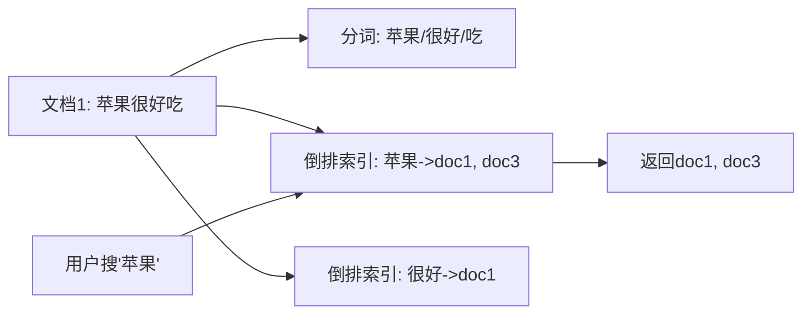
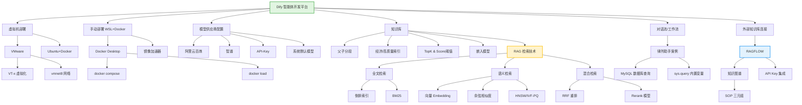

# Dify 工作流部署与 RAG 技术栈（AI 增强版）

**🔧 AI 审核版本：v3.6**

> [!note] 学习元数据
> - **原始来源**：课堂笔记《虚拟机部署Dify》+ day03《RAG三步检索法》+ AI优化版《Dify工作流》
> - **合并日期**：2026-07-13
> - **核心主题**：Dify 私有化部署、RAG 检索技术、知识库构建、律所助手实战
> - **前置知识**：Docker 基础、Linux 基础命令、MySQL 基本操作
> - **难度分布**：🔹 基础 3 处 / 🔸 核心 6 处 / 🔺 难点 3 处

---

## 核心速览

> - **虚拟化技术（VT-x）**：CPU 硬件扩展，允许多 OS 同时运行，VMware 依赖此实现硬件加速，未开启性能下降 70%~90%。
> - **Dify 部署四方案**：虚拟机（解压即用）、线上版（需科学上网）、手动部署（WSL+Docker）、共享访问（多人协作），按需选择。
> - **RAG 三步检索法**：全文检索（倒排索引+BM25，精准匹配）→ 语义检索（向量+余弦相似度，理解意图）→ 混合检索（RRF 重排，综合最优）。
> - **父子分段机制**：Dify 特色存储结构，子段用于检索匹配，父段提供完整上下文，兼顾精准与语境完整。
> - **知识图谱（SOP 三元组）**：RAGFLOW 特色，抽取实体-关系-实体三元组，实现基于关系路径的精准推理查询。
> - **模型供应商配置**：Dify 本身不内置 LLM，需通过插件接入第三方 API（阿里云百炼、智谱等），并设置系统默认模型。
> - **容器网络陷阱**：Dify 容器内 `127.0.0.1` 指向容器自身，连接宿主机服务必须用网卡 IP（如 `192.168.25.31`）。
> - **向量维度权衡**：1536 维是 OpenAI 带起的主流规格，维度越高精度越高但计算越慢，需根据场景平衡。

---

## 1️⃣ 完整知识库

> **组织规则**：按逻辑主题分节，每节按"定义与本质 → 基础用法 → 进阶原理 → 避坑与局限"四层组织。

---

### 1.1 虚拟化技术与 BIOS 设置 🔹 基础

#### 定义与本质
虚拟化技术（Intel VT-x / AMD-V）是 CPU 硬件层面的扩展，允许单台物理机同时运行多个操作系统。虚拟机软件（如 VMware）依赖此技术实现硬件加速，否则虚拟机运行极其缓慢甚至无法启动。

#### 基础用法

**常见笔记本进 BIOS 快捷键速查表：**

| 品牌/系列                                            | 快捷键 | 备注             |
| ---------------------------------------------------- | ------ | ---------------- |
| 联想小新 / 拯救者 / 华为 / 小米 / 华硕 / 戴尔 / 宏碁 | F2     | 开机连续点按     |
| ThinkPad                                             | F1     | 部分机型需 Fn+F1 |
| 惠普                                                 | F10    | ESC → F10 也可   |
| 微星 / 神舟 / 机械革命 / 雷神                        | Del    | 台式机通用       |

> 💡 **补充说明**：F 键无反应时尝试 `Fn + Fx`；或通过 Windows 设置 → 更新与安全 → 恢复 → 高级启动 → UEFI 固件设置直接进入。

#### 进阶原理
虚拟化技术通过 **VMCS（虚拟机控制结构）** 管理 CPU 状态切换，实现 Guest OS 与 Host OS 之间的高效上下文切换。未开启时，VMware 退化为二进制翻译模式（Binary Translation），性能下降 **70%~90%**。

#### 避坑
- **常见错误**：开启 Hyper-V 后 VMware 无法启动 → 需关闭 Windows 的 Hyper-V 和内核隔离（内存完整性）。
- 进入 BIOS 后通常位于 "Advanced" → "Intel Virtualization Technology" → 设为 Enabled。

---

### 1.2 Dify 环境部署方案对比 🔹 基础

#### 定义与本质
Dify 是一个开源的 LLM 应用开发平台，支持本地部署，区别于 Coze 等公网服务。其核心价值在于：**数据私有化** + **可二次开发** + **自主可控**。

#### 四种部署思路

| 方案     | 适用场景                       | 优点           | 缺点                   |
| -------- | ------------------------------ | -------------- | ---------------------- |
| 虚拟机   | 课程配套，解压即用，适合新手   | 零配置、最快捷 | 需≥8G 内存，占磁盘大   |
| 线上版   | 临时体验、环境受限             | 无需安装       | 需科学上网，数据不私有 |
| 手动部署 | 生产环境、定制化需求           | 可控性强       | 步骤多，需 Docker 基础 |
| 共享访问 | 多人协作、低配机器（内存≥16G） | 节省资源       | 网络依赖，并发受限     |

线上版具体网址：`https://cloud.dify.ai/tools`，类似于 Coze 的浏览器访问方式，但需科学上网才能访问页面。

---

### 1.3 Dify 虚拟机部署详解 🔸 核心

> 适用于课程配套虚拟机 `dify_ubuntu.7z`，解压后使用 VMware 打开。

#### 定义与本质
虚拟机是预装了 Ubuntu + Docker + Dify 服务的完整运行环境，用户无需手动安装依赖，开机即用。

#### 基础用法

**操作步骤：**

1. 解压 `dify_ubuntu.7z`（**不要解压到同步网盘文件夹内**，否则会拖慢同步）。
2. 双击 `.vmx` 文件，自动打开 VMware。
3. 修改虚拟机内存为 **6~8 GB**（点击"编辑虚拟机设置" → 内存）。
4. **（推荐）重置网络适配器**：
   - 编辑 → 虚拟网络编辑器 → 更改设置 → 还原默认设置 → 应用。
   - 检查本机 `vmnet8` 网卡的 IPv4 地址是否为 `192.168.88.1`（子网掩码 `255.255.255.0`）。
5. 恢复快照至 `RAGFlow0.24` 状态（快照含 Dify 最新运行态）。
6. **首次启动必须选择"我已移动该虚拟机"**（选"复制"会导致网络 MAC 变化，IP 可能错乱）。
7. 等待自检（约 2 分钟），出现登录提示后按回车。

**登录账户：**

| 角色 | 用户名    | 密码     | 推荐 |
| ---- | --------- | -------- | ---- |
| 超管 | `root`    | `123456` | ✅    |
| 游客 | `itheima` | `123456` |      |

#### 进阶用法

**Docker 操作命令（需在 Dify 路径下执行）：**

```bash
# 首先进入 dify 目录
cd /root/dify/dify/docker   # 虚拟机内默认路径

# 启动所有服务（后台运行）
docker compose up -d
# 输出：Creating network "docker_default"...  ✔
# 输出：Container docker-web-1     Started   ✔
# 输出：Container docker-api-1     Started   ✔
# 输出：Container docker-worker-1  Started   ✔

# 查看运行状态
docker compose ps
# 输出：NAME          IMAGE              STATUS         PORTS
# 输出：docker-web-1  nginx:latest       Up 2 minutes   0.0.0.0:80->80/tcp
# 输出：docker-api-1  langgenius/api    Up 2 minutes   5001/tcp

# 停止服务（不删除数据）
docker compose stop
# 输出：[+] Stopping 3/3  ✔

# ⚠️ 危险：停止并删除所有容器数据（恢复出厂状态）
docker compose down
# 输出：[+] Removing 3/3  ✔
```

**访问地址**：浏览器输入 `192.168.88.100` 或 `192.168.88.100/install`，等待加载（较慢）。设置账户密码成功后即进入 Dify 页面。

> 💡 AI 扩展（基础）：**为什么 Dify 使用 Docker Compose 而非单个容器？**
>
> Dify 依赖 6 个核心服务：Web 前端（Nginx）、API 后端（Python/Flask）、Worker（Celery 异步任务）、PostgreSQL（数据库）、Redis（缓存）、Weaviate（向量数据库）。Compose 通过 `docker-compose.yml` 编排多容器协同，实现服务间网络通信和依赖管理。

#### 避坑与局限

| 错误现象                              | 原因            | 解决方案                                |
| ------------------------------------- | --------------- | --------------------------------------- |
| 启动后浏览器无法访问 `192.168.88.100` | VMware 网络异常 | 重置虚拟网络编辑器 + 检查 vmnet8 配置   |
| 虚拟机启动后黑屏                      | 内存不足        | 分配至少 6GB 内存，关闭宿主机占内存应用 |
| 选错"我已复制该虚拟机"导致 IP 变化    | MAC 地址重置    | 重新选择"我已移动"，或手动修改 IP       |
| 未关闭容器直接关虚拟机                | 数据损坏风险    | **务必先 `docker compose stop` 再关机** |

---

### 1.4 Dify 手动部署（WSL + Docker） 🔸 核心

> 适用于无虚拟机、希望在本机 Windows 上原生部署的场景。

#### 定义与本质
通过 **WSL2（Windows Subsystem for Linux 2）** + **Docker Desktop** 在 Windows 上运行 Linux 容器，实现 Dify 原生部署。

#### 基础用法

**Step 1：开启 WSL 环境**
- 控制面板 → 程序和功能 → 启用或关闭 Windows 功能 → 勾选"适用于 Linux 的 Windows 子系统" + "虚拟机平台" → 重启。
- 安装物料中的 `wsl.2.6.3.0.x64.msi`。
- 执行命令安装 Ubuntu（路径需替换为实际物料路径）：
  ```powershell
  Add-AppxPackage D:\物料\CanonicalGroupLimited.UbuntuonWindows_2004.2021.825.0.AppxBundle
  ```
- 安装后在系统中搜索 Ubuntu，打开设置账户密码即可。

**Step 2：安装 Docker Desktop**
- 双击 `Docker Desktop Installer.exe` → 安装 → 重启。
- 配置镜像加速器（**必须**，否则国内拉取极慢）：
  ```json
  {
    "builder": {
      "gc": {
        "defaultKeepStorage": "20GB",
        "enabled": true
      }
    },
    "experimental": false,
    "registry-mirrors": [
      "https://docker.m.daocloud.io",
      "https://hub-mirror.c.163.com",
      "https://mirror.baidubce.com",
      "https://ccr.ccs.tencentyun.com"
    ]
  }
  ```
- 然后点击 `Apply & restart`。

**Step 3：安装 Dify**
- 解压 `dify-main.zip` 到**非同步文件夹**（路径不要有中文或空格）。
- 进入 `dify-main/docker` 目录。
- 导入镜像包（加速启动，路径替换为实际路径）：
  ```bash
  docker load -i D:\物料\all-docker-images.tar
  # 输出：Loaded image: langgenius/dify-api:latest
  # 输出：Loaded image: langgenius/dify-web:latest
  # （约 20 个镜像依次加载）
  ```
- 启动服务：
  ```bash
  docker compose up -d
  ```

**访问地址**：`127.0.0.1/install` 或 `127.0.0.1`（首次需要注册账户）。

#### 避坑
- **路径问题**：物料路径不要含中文、空格、同步文件夹。
- **Docker 未启动**：`docker compose up -d` 前必须确认 Docker Desktop 右下角显示 "Engine Running"。
- **端口冲突**：若 `127.0.0.1:80` 被占用，修改 `docker-compose.yml` 中 Web 端口映射。
- **服务停掉后无法登录**：`docker compose stop` 停止后 Dify 无法访问，需重新 `docker compose up -d` 启动。

---

### 1.5 Dify 配置模型供应商 🔸 核心

#### 定义与本质
Dify 本身不内置 LLM，需通过 **模型供应商（Model Provider）** 接入第三方模型 API。支持的供应商包括阿里云百炼、OpenAI、智谱、Azure 等。

#### 基础用法

**安装插件（以通义千问为例）：**

1. 进入 Dify 主界面 → 右上角"插件" → 搜索"Tongyi" → 安装。
2. 头像 → 设置 → 模型供应商 → 找到"Tongyi" → 填入 API-Key → 保存。

**API-Key 获取方式（阿里云百炼）：**
- 登录阿里云百炼控制台（https://bailian.console.aliyun.com/）
- 左侧菜单 → API-KEY 管理 → 创建 API-KEY → 复制。

**配置系统默认模型：**
- 设置 → 模型供应商 → 系统模型设置 → 选择已配置的推理模型（如 `qwen-turbo`）。
- 验证：新建聊天助手 → 发送测试消息 → 正常回复即配置成功。

**Dify 支持的模型类型分类：**

| 类型                  | 作用                   | 示例              |
| --------------------- | ---------------------- | ----------------- |
| 推理模型（LLM）       | 理解用户意图、生成回复 | qwen-turbo, gpt-4 |
| 嵌入模型（Embedding） | 将文本转为向量         | text-embedding-v4 |
| 重排模型（Rerank）    | 对检索结果二次排序     | gte-rerank        |
| 语音转文字（ASR）     | 语音输入转文本         | Paraformer        |
| 文字转语音（TTS）     | 文本转语音输出         | Sambert           |

#### 避坑
- **模型未配置系统模型**：新建应用时提示"未找到可用模型" → 到设置中指定默认模型。
- **API-Key 无效**：检查阿里云百炼账户余额是否充足（需先充值）。
- **插件安装失败**：确认 Docker 网络可访问 GitHub Release 资源。

---

### 1.6 RAG 核心技术 —— 三步检索法详解 🔺 难点

#### 定义与本质
RAG（Retrieval-Augmented Generation）即"检索增强生成"，通过**外挂知识库**为大模型提供私有数据支持，克服模型知识截止和幻觉问题。核心流程：**离线建库（文档 → 索引）** + **在线检索（问题 → 召回 → 重排 → 生成）**。

RAG 有两条工作线：
- **离线流程**：将知识存入知识库，生成倒排索引和向量存储。
- **在线流程**：将用户查询转换为向量，从知识库中检索，通过检索得到参考资料，用于增强提示词的上下文信息，最终生成合适的回答。

#### 三种检索方式对比

| 检索方式 | 核心技术               | 优点             | 缺点               |
| -------- | ---------------------- | ---------------- | ------------------ |
| 全文检索 | 倒排索引 + BM25        | 精确匹配，速度快 | 无法理解语义同义词 |
| 语义检索 | 向量嵌入 + 余弦相似度  | 理解意图，泛化强 | 计算量大，易跑偏   |
| 混合检索 | 全文 + 语义 + RRF 重排 | 综合最优         | 实现复杂，成本高   |

---

#### 第一步：全文检索（像查字典，精准匹配）

这是最"死板"但也最快速的方法。就像你拿到一本书，按**拼音索引**或**笔画索引**去查某个词出现在哪一页。

- **关键词**：读者说要"苹果"。管理员只认这俩字，绝不给你找"橘子"或"水果"。
- **倒排索引（核心黑科技）**：管理员手里有个超级大本子，上面写着："苹果"这个词出现在第 5 页、第 89 页、第 200 页。反过来，不看"书"的目录，而看"词"的目录，这就叫"倒排"。
- **结果**：刷刷刷，0.01 秒就把所有带"苹果"字样的书全扔到你面前。
- **缺点**：如果你搜"手机"，却把"iPhone"写成"爱疯"，那管理员就一脸懵。**它只管"有没有这个词"，完全不懂"你想要啥意思"。**

**倒排索引原理图示：**



- 核心：倒排索引即"词 → 文档列表"的映射表，查询时 O(1) 定位。

---

#### 第二步：语义检索（像找知音，理解意图）

这是为了解决第一步"死板"的毛病。管理员不再死抠字眼，而是琢磨你的**心思**。

- **向量（核心黑科技）**：管理员脑子里有个"思维地图"。他把每本书都想象成一个**坐标点**。比如：笑话书在坐标（0，10），科幻小说在（5，8），严肃历史在（-10，-10）。
- **相似度计算**：他把你的问题也变成一个坐标点，然后在地图上画圈，**找离你这个问题点最近的几本书**（数学上叫余弦相似度）。
- **结果**：哪怕书里没有一个"打"字，也没有"发"字，但只要它离你的"开心"坐标近（比如是幽默漫画），它就被捞出来了。
- **缺点**：计算量巨大，而且有时候太"发散"。你本来想找"苹果手机"的维修手册，结果它觉得"苹果"和"牛顿"、"砸到头"意思相近，给你推了一堆物理书，这就偏了。

**向量与相似度匹配：**

**向量**是一组数字，表示文本在 N 个维度上的语义得分。例如：

- "我好喜欢你哦" → 在"喜爱"维度得 **0.8**
- "我好讨厌你哦" → 在"喜爱"维度得 **-0.5**

**二维场景**（维度：喜爱，饥饿）：
- "我好喜欢你哦" → [0.8, -0.1]
- "我好喜欢吃土豆，还饿死了" → [0.8, 0.9]
- 用户搜"我好爱你" → [0.9, -0.1]
- **相似度匹配**：计算向量夹角余弦值，夹角越小越相似。结果匹配第一条（方向一致）。

**高维场景**：实际嵌入模型提供 768~1536 维，维度越高表达越精细。例如阿里云 `text-embedding-v4` 提供 **1536 维**，每句话在 1536 个维度上都有得分，检索精度显著提升。

> 💡 AI 扩展（基础）：**1536 维是标准吗？**
>
> 1536 维是 OpenAI 带起的行业主流规格，但不是唯一标准。不同嵌入模型的维度差异如下：
>
> | 模型                   | 维度          | 精度 | 速度 |
> | ---------------------- | ------------- | ---- | ---- |
> | text-embedding-ada-002 | 1536          | 高   | 中   |
> | all-MiniLM-L6-v2       | 384           | 中   | 快   |
> | BGE-M3                 | 1024          | 高   | 中   |
> | text-embedding-3-large | 256/1024/3072 | 可调 | 可调 |
>
> **取舍原则**：维度越高精度越高，但存储和计算成本也越高。有实验表明，维度从 768 提升到 1536，语义检索召回率能提升 **18%**，但推理延迟增加了 **40%**。需根据场景平衡。

---

#### 第三步：混合检索（像资深专家，综合裁决）

第一步快但死板，第二步聪明但爱跑偏。怎么办？**把两个管理员叫到一起开会，综合打分。**

- **汇总（大杂烩）**：先把第一步找出来的 100 本"有苹果二字"的书，和第二步找出来的 100 本"和苹果意图相关"的书，合并在一起（可能有 150 本，因为有的书两边都上榜了）。
- **再次排序（重排——终极绝招）**：资深专家出场。他不只看"关键词得分"，也不只看"语义相似度得分"，而是用一套更复杂的算法，把这 150 本书从头到尾捋一遍。
  - 如果这本书关键词匹配度极高，语义分也极高，那它排第一。
  - 如果这本书关键词有，但语义飘了，给它降级。
- **结果**：最终端给你的，是一份**按"综合实力"**排名的最优名单。

**RRF（Reciprocal Rank Fusion）算法：**

```text
最终得分 = Σ ( 1 / ( k + rank_position ) )
# k 为常数（通常取 60），防止排名靠后文档分数过低
```

**实际案例推演**（搜"轻便的跑步鞋"）：

| 文档 | 全文检索排名 | 语义检索排名 | RRF 得分           | 最终排名 |
| ---- | ------------ | ------------ | ------------------ | -------- |
| A    | 1            | 2            | 1/61+1/62=0.0325   | 1        |
| B    | 2            | 1            | 1/62+1/61=0.0325   | 2        |
| C    | 100          | 99           | 1/160+1/159≈0.0125 | 淘汰     |

> 💡 AI 扩展（进阶）：**RRF 算法的底层推演**
>
> 为什么不用加权平均？因为全文检索的 BM25 分数范围（0~∞）与语义检索的余弦相似度（-1~1）量纲不同，直接加权没有意义。RRF 通过"只看排名不看分数"巧妙解决了跨模型分数不可比的问题。
>
> 常数 k=60 的经验来源：在 TREC 评测数据集上，k 值在 40~80 之间时 RRF 的 MAP（平均准确率均值）表现最稳定。k 过小会导致头部文档权重过高，k 过大会削弱排名差异的区分度。

#### 避坑与局限
- **全文检索局限**：同义词无法召回（搜"手机"找不到"iPhone"）。
- **语义检索局限**：可能过度泛化（搜"苹果手机"召回"苹果水果"）。
- **混合检索成本**：需同时维护两套索引 + Rerank 模型，存储和计算成本翻倍。

---

### 1.7 Dify 知识库 🔸 核心

#### 定义与本质
Dify 知识库是 RAG 的离线数据源，支持上传文档（TXT/PDF/Word/Markdown/Excel）并进行智能分段、向量化存储。

#### 基础用法

**父子分段机制**（Dify 特色）：
- **父段**：提供完整上下文（如一段完整的法律条款）。
- **子段**：父段的细化切分（如条款中的每一条目）。
- 检索时匹配子段，但返回父段作为上下文，兼顾"精准命中"和"完整语境"。


**索引方式对比：**

| 模式       | 技术栈             | 优点       | 缺点                            |
| ---------- | ------------------ | ---------- | ------------------------------- |
| 经济模式   | 低配全文检索       | 免费、超快 | 最多匹配 10 个关键词，不准      |
| 高质量模式 | 全文/语义/混合自选 | 准         | 消耗 Embedding/Rerank Token，慢 |

**检索设置参数：**
- **TopK**：召回片段数量（建议 3-10，越大上下文越丰富但 Token 消耗越大）。
- **Score 阈值**：向量相似度最小阈值（建议 0.7~0.8，过滤低质量匹配）。
- **权重设置**：混合检索中可自己决定全文和语义的占比。
- **Rerank 模型**：用模型决定语义和全文的最终排序（如阿里云 `gte-rerank` 模型）。

> 💡 AI 扩展（基础）：**为什么 Dify 的父子分段比普通分段更优？**
>
> 常规分段方式（如按 500 字符切分）可能导致检索命中一段零散内容，但缺乏前后语境。Dify 的父子分段实际上是一种"粗粒度索引 + 细粒度匹配"策略：
> - 建立索引时仅对子段建立向量索引（精细匹配）
> - 召回时通过父子关系找到父段（完整上下文）
> - 这样既保证匹配精度，又保证生成时的上下文完整性。

#### 避坑
- **嵌入模型一致性**：索引时用的嵌入模型必须与检索时一致，否则向量空间不对齐。
- **文档分段过大**：超过 Embedding 模型最大 Token 限制会导致截断，需先切分再索引。

---

### 1.8 RAGFLOW 部署与集成 🔸 核心

#### 定义与本质
RAGFLOW 是另一款开源 RAG 引擎，特色是支持 **知识图谱（SOP 三元组）** 构建。区别于 Dify 的纯向量检索，RAGFLOW 可提取文档中的"实体-关系-实体"三元组，实现基于关系的精准查询。

#### DeepDoc 深度文档解析引擎

RAGFLOW 内置 **DeepDoc** 文档解析引擎，能将复杂的非结构化文档（PDF、Word、Excel、PPT）转换为结构化文本，是 RAGFLOW 区别于 Dify 知识库的核心优势：

| 能力 | 说明 |
| --- | --- |
| 版面分析 | 识别标题、段落、表格、图片等版面元素的位置和层级关系 |
| 表格还原 | 将文档中的表格精确还原为 Markdown 表格格式，保留行列结构 |
| OCR 识别 | 对扫描件、图片中的文字进行识别，支持中英文混排 |
| 智能分段 | 基于版面分析结果进行语义分段，避免跨段切割 |

> [!tip] 与 Dify 知识库的区别
> Dify 的知识库分段主要依赖文本规则（分隔符、固定长度），而 RAGFLOW 通过 DeepDoc 理解文档结构，实现更精准的分段和检索。对于含大量表格、复杂排版的文档（如法律合同、财务报表），RAGFLOW 的解析质量显著优于 Dify。

#### 基础用法

**部署步骤：**
1. 解压 `ragflow.zip` 到非同步目录。
2. 进入 `ragflow/docker` 目录。
3. 在空白地方按住 `shift` + `鼠标右键`，点击弹出的"PowerShell 中打开"。
4. 确保 Docker Desktop 运行中，执行：
   ```bash
   docker compose up -d
   ```
5. 访问 `127.0.0.1:8880` → 注册账号 → 登录。

**知识图谱原理示例：**

原文：
```text
本社区本月共开展民生活动 12 场，服务居民约 1800 人次。重点解决供暖问题 35 起，协助老年群体体检预约 62 人。宣传反诈讲座共 3 场，覆盖居民 500 余人次。社区内未发生重大安全事故。
```

抽取的 SOP 三元组：
- `(社区, 开展, 民生活动)` → 12
- `(民生活动, 包含, 供暖服务)`
- `(居民, 参加, 供暖服务)` → 35
- `(老年群体, 参加, 体检)` → 62
- `(社区, 服务, 居民)` → 1800
- `(居民, 包含, 老人)`
- `(老人, 参加, 群体体检)` → 62

查询"老年人参与了哪些服务"→ 图谱检索返回：体检服务（62 人次）、反诈讲座（3 次）。

**对比传统检索：**
- 全文检索：必须出现"老年人"关键词。
- 语义检索：可能泛化到"老年""老人""长者"。
- 知识图谱：**基于关系推理**，精准识别"老年群体"参与的"服务"实体。

**优缺点：**
- 优点：查找更精准，特别适合带有明确关系要求的查询。
- 缺点：烧钱、费时。

> 💡 AI 扩展（进阶）：**知识图谱 vs 向量检索的本质区别**
>
> | 维度     | 向量检索       | 知识图谱             |
> | -------- | -------------- | -------------------- |
> | 查询方式 | 语义相似度匹配 | 关系路径推理         |
> | 返回结果 | 文本片段       | 结构化三元组         |
> | 适用场景 | 开放域问答     | 结构化/多跳问答      |
> | 典型问题 | "什么是RAG？"  | "A与B的关系是什么？" |
>
> 知识图谱适合"有明确关系"的查询（如组织机构、人物关系、因果链条），向量检索适合"开放描述性"查询（如概念解释、内容总结）。

#### 避坑
- **API 地址不能用 `127.0.0.1`**：从 Dify 连接 RAGFLOW 时，必须填写本机网卡 IP（如 `192.168.25.31`），因为 `127.0.0.1` 在容器内指向容器自身，而非宿主机。
- **阿里云 Embedding 限流**：遇到 `Account abnormal` 错误 → 说明调用次数超限，可切换到智谱 Embedding 模型。

**BUG 解决：`Account abnormal` 错误**

如果遇到解析文件时报错：
```text
[ERROR][Exception]: Exceptions from Trio nursery (20 sub-exceptions) -- Account abnormal. Please ensure it's on good standing to use QWen's text-embedding-v2
```

原因：`ragflow` 调用阿里云 Embedding API 过猛，阿里云拒绝服务。

解决步骤：
1. 更换嵌入模型的提供商，从阿里云换为**智谱**（地址：`https://open.bigmodel.cn/`，注册、实名、创建 API-KEY 即可）。
2. 在 RAGFLOW 设置 → 模型配置中，将 Embedding 模型切换为智谱。
3. 提供智谱 API-KEY，配置系统默认模型的嵌入模型。
4. 重建知识库解决。

---

### 1.9 Dify 连接 RAGFLOW 外部知识库 🔸 核心

#### 定义与本质
Dify 支持通过 API 调用外部知识库，将 RAGFLOW 作为"知识供给方"接入 Dify 工作流。

#### 操作步骤

**RAGFLOW 侧：**
1. 进入 RAGFLOW → 右上角头像 → API Key → 创建密钥 → 复制。
2. 复制 API 服务器地址（注意：本地部署时不能用 `127.0.0.1`，需用网卡 IP）。
3. 找到需要连接的知识库 ID（在知识库列表的 URL 中：`/knowledge/xxx`）。

**Dify 侧：**
1. 头像 → 设置 → 外部知识库 → 添加。
2. 填入 RAGFLOW API 地址：`http://192.168.xx.xx:9380/api/v1`。
3. 填入 API-Key 和知识库 ID。
4. 在工作流中拖入"知识库检索"节点 → 选择外部知识源 → 测试检索。

#### 避坑
- **网络连通性**：确保 Dify 容器可 ping 通 RAGFLOW 宿主机的 IP。
- **API 版本兼容**：需确保 RAGFLOW 版本与 Dify 适配（建议使用课程提供的版本）。

---

### 1.10 律所助手案例开发 🔸 核心

#### 定义与本质
一个完整的 Dify 对话流应用，集成 **数据库查询** 实现法律服务定价查询，展示 Dify 在企业内部数据接入方面的实战能力。

#### 技术选型对比

| 工具      | 是否适用 | 原因                                                     |
| --------- | -------- | -------------------------------------------------------- |
| Coze      | ❌ 排除   | 公网服务，企业数据敏感无法上传；发布后需二次开发嵌入网页 |
| LangChain | ❌ 排除   | 需求简单，代码开发成本高                                 |
| **Dify**  | ✅ 最优   | 私有部署 + 数据库直连 + 一键嵌入代码                     |

#### 工作流 vs 对话流

| 维度     | 对话流                      | 工作流                |
| -------- | --------------------------- | --------------------- |
| 触发方式 | 用户聊天输入（`sys.query`） | 手动/API 触发         |
| 内置变量 | `sys.query`, `sys.files`    | 需定义输入变量        |
| 适用场景 | 聊天机器人、客服            | 批处理、定时任务、ETL |
| 循环支持 | 不支持                      | 支持（迭代节点）      |

> 两者底层都是 DAG（有向无环图）编排，但对话流专为"交互式对话"优化。开始节点无需添加子段，因为对话流就是对话框，系统提供内置变量。

#### 数据库操作

**建表 SQL：**

```sql
CREATE DATABASE IF NOT EXISTS law_assistant CHARSET utf8;
USE law_assistant;

CREATE TABLE IF NOT EXISTS legal_service_pricing (
    service_id INT AUTO_INCREMENT PRIMARY KEY,
    service_name VARCHAR(255) NOT NULL COMMENT '服务名称',
    service_description TEXT COMMENT '服务描述',
    price DECIMAL(10, 2) NOT NULL COMMENT '价格（元）',
    billing_unit ENUM('按小时', '按次', '按项目') NOT NULL COMMENT '计费单位',
    lawyer_id INT NOT NULL COMMENT '律师ID',
    is_active BOOLEAN DEFAULT TRUE COMMENT '是否启用',
    created_at TIMESTAMP DEFAULT CURRENT_TIMESTAMP,
    updated_at TIMESTAMP DEFAULT CURRENT_TIMESTAMP ON UPDATE CURRENT_TIMESTAMP
);

-- 插入 20 条示例数据
INSERT INTO legal_service_pricing (service_name, service_description, price, billing_unit, lawyer_id) VALUES
('初次法律咨询', '针对一般法律问题的初步分析和建议（每小时）', 800.00, '按小时', 101),
('合同审查（标准）', '对标准商业合同进行合规性与风险审查（按次）', 2500.00, '按次', 102),
('民事诉讼一审代理', '代理普通民事纠纷案件的一审程序（全案）', 30000.00, '按项目', 105),
('商标注册申请', '国内商标查询、材料准备及提交代理服务', 3800.00, '按项目', 104),
('定制协议起草', '根据需求起草专项法律协议（每小时）', 1200.00, '按小时', 101),
('公司股权激励方案设计', '设计并制定员工股权激励计划方案', 25000.00, '按项目', 106),
('律师函出具', '就特定事务起草并发出正式律师函', 1500.00, '按次', 103),
('劳动争议仲裁代理', '代理用人单位或员工参与劳动仲裁程序', 12000.00, '按项目', 107),
('刑事案件侦查阶段辩护', '在公安侦查阶段为犯罪嫌疑人提供辩护', 20000.00, '按项目', 108),
('尽职调查（基础）', '针对中小规模企业的基础法律尽职调查', 18000.00, '按项目', 106),
('个人遗嘱起草与公证', '协助起草个人遗嘱并提供公证指引', 1000.00, '按次', 109),
('知识产权侵权维权', '针对商标、专利等侵权行为的初步维权措施', 9000.00, '按项目', 104),
('债务催收服务', '通过非诉讼方式进行商业债务催收', 4500.00, '按项目', 110),
('法律顾问服务（月度）', '提供月度日常法律咨询及简单文件审阅', 5000.00, '按小时', 102),
('离婚协议协商与起草', '协助协商并起草离婚相关法律协议', 6000.00, '按项目', 109),
('数据合规方案辅导', '帮助企业初步建立数据合规框架', 15000.00, '按项目', 111),
('上诉状起草', '针对一审判决起草民事上诉状', 4000.00, '按次', 105),
('商业秘密保护制度构建', '协助企业制定内部商业秘密保护制度', 22000.00, '按项目', 111),
('房产买卖合约审阅', '审阅商品房或二手房买卖相关合同', 2000.00, '按次', 112),
('投资条款清单（Term Sheet）分析', '对投资条款清单的关键风险点提供分析意见', 3500.00, '按次', 106);

-- 输出：Query OK, 20 rows affected

-- 授权 root 远程登录（用于 Dify 连接）
CREATE USER IF NOT EXISTS 'root'@'%' IDENTIFIED BY '123456';
GRANT ALL PRIVILEGES ON *.* TO 'root'@'%' WITH GRANT OPTION;
FLUSH PRIVILEGES;
-- 输出：Query OK, 0 rows affected
```

**Dify 数据库查询节点配置：**

| 配置项     | 值（云服务器示例）                             | 值（本地部署示例）                 |
| ---------- | ---------------------------------------------- | ---------------------------------- |
| 数据库类型 | MySQL                                          | MySQL                              |
| 主机地址   | `rm-xxx.mysql.rds.aliyuncs.com`                | `192.168.25.31`（不能用127.0.0.1） |
| 端口       | 3306                                           | 3306                               |
| 数据库名   | `law_assistant`                                | `law_assistant`                    |
| 用户       | `root`                                         | `root`                             |
| 密码       | `xxx`                                          | `123456`                           |
| 连接参数   | `charset=utf8mb4&collation=utf8mb4_0900_ai_ci` | 同左                               |

**SQL 查询语句：**

```sql
SELECT * FROM legal_service_pricing WHERE 1=1
```

#### 避坑
- **本地部署的数据库地址**：在 Dify 容器内部，`127.0.0.1` 指向容器自身而非宿主机，必须填写宿主机网卡 IP。
- **SQL 注入风险**：Dify 的数据库查询节点支持参数化查询，建议使用 `{{变量}}` 而非字符串拼接。

---

### 1.11 混合索引底层原理 🔺 难点

> 本节对应原笔记中"三步检索法"和"混合索引底层"的深度解析部分。

#### 定义与本质
混合索引在底层是**两套物理隔离的索引系统**并行工作：全文索引（倒排索引）和向量索引（HNSW/IVF-PQ）。查询时两条线程独立运行，最终由 RRF 算法融合排名。

#### 两套索引的物理结构

**全文索引（倒排索引）：**
- 数据结构：哈希表 + 跳跃表，Key 为词语，Value 为文档 ID 列表（含词频、位置）。
- 存储优化：使用 FST（有限状态转换器）压缩词项字典。
- 查询复杂度：O(1)（哈希查找）~ O(log N)（跳跃表）。

**向量索引（ANN 算法）：**

| 算法   | 核心思想                        | 优点             | 缺点         |
| ------ | ------------------------------- | ---------------- | ------------ |
| HNSW   | 多层图结构，顶层粗跳 + 底层精查 | 召回率高，精度高 | 内存占用大   |
| IVF-PQ | 聚类分桶 + 向量量化压缩         | 内存占用极低     | 存在量化误差 |

**HNSW 游走模拟**（1 亿数据）：
1. 顶层（第 2 层）：100 个聚类中心，查询向量 Q 找到最近的"动物"节点。
2. 中间层（第 1 层）：1 万个节点，沿边游走到"金毛+海滩"区域。
3. 底层（第 0 层）：在局部数百个节点内暴力计算精确距离。
4. 总耗时：**15 毫秒**。

**IVF-PQ 压缩案例**（50 亿商品，768 维 float）：
- 原始大小：50 亿 × 768 × 4 字节 = **1.4 TB**
- PQ 压缩后（切 8 段，256 码本）：50 亿 × 8 字节 = **4 GB**
- 压缩率：**99.7%**，召回率保持 95%+

#### 查询时的并行流水线

1. **线程 A**（倒排索引）：分词 → 查 FST → 取倒排列表 → 计算 BM25。
2. **线程 B**（向量索引）：问题 → Embedding 模型 → 向量 → 输入 HNSW/IVF-PQ → 返回 TopK 余弦相似度。
3. **融合器**（RRF）：将两路排名的位置代入 `1/(60+rank)` → 加权求和 → 最终排名。

> 💡 AI 扩展（进阶）：**BM25 公式详解**
>
> ```text
> Score = IDF * ( (tf * (k1+1)) / (tf + k1 * (1 - b + b * (docLen / avgDocLen))) )
> ```
>
> - **IDF**：逆文档频率，常见词（如"的"）IDF 接近 0，降低权重。
> - **k1（饱和因子，默认 1.2）**：控制词频饱和度，100 次重复不会带来 100 倍分数增长。
> - **b（长度归一化，默认 0.75）**：长文档命中关键词惩罚因子，短文命中权重更高。
>
> 这种设计有效抵抗了"关键词堆砌"作弊，是工业级搜索的标配。

#### 三个硬核案例推演

**案例一：企业专利查新（全文索引 BM25 的极致应用）**

场景：法务人员检索专利库，查找包含精确术语"化合物X 制备方法"的专利。

- 分词器切出"化合物X"、"制备"、"方法"，查倒排字典，拉出包含这三个词的文档列表。
- 专利A（5000字长文）：提到2次"化合物X"，BM25 计算时长文档被惩罚，最终得分 **12.8**。
- 专利B（800字短文）：提到1次"化合物X"，但"制备"和"方法"均出现在标题中。短文档权重加成，最终得分 **18.5**。
- **结果**：专利B排第一。全文索引在此场景下**零语义偏移**，确保精确术语不会被 AI 误解。

**案例二：短视频"以图搜图/模糊语义推荐"（向量索引 HNSW 的极致应用）**

场景：用户输入"治愈系落日海边小狗"，在 1 亿视频库中召回。

- 离线将 1 亿个视频封面图/文本描述过 Embedding 模型，转为 **768维向量**，存入 HNSW 图结构。
- 查询词实时转成向量 Q。
- HNSW 游走：顶层 100 个聚类中心 → Q 离"动物"中心最近 → 中间层 1 万个节点 → "海岸"节点更近 → 底层锁定"金毛+海滩"密集区域 → 局部精确计算。
- **结果**：耗时仅 **15毫秒**，召回前 100 名。结果里不仅有"金毛"，还会有"拉布拉多在沙滩奔跑"（语义向量距离极近）。

**案例三：电商千亿级商品"同款比价"（向量索引 IVF-PQ 的极致应用）**

场景：50 亿件商品，用户搜"长款黑色羽绒服男"，需控制内存成本且毫秒级响应。

- **IVF 聚类（分桶）**：离线将 50 亿商品向量聚成 **4096 个桶**。查询时只挑最近的 2 个桶，瞬间过滤掉 99.9% 数据。
- **PQ 乘积量化（压缩）**：把 768 维 float 切成 8 段，每段用 256 个码本表示，压缩后仅占 **8 字节**。
- **结果**：内存从 **1.4 TB** 压缩至 **4 GB**，召回率保持 95% 以上。

#### 避坑
- **存储膨胀**：全文索引 + 向量索引并存，存储开销约 6~10 倍于原始数据。需用 PQ 等压缩技术控制。
- **实时更新困难**：向量索引（尤其是 HNSW）新增文档需重构局部图结构，工业界采用"双缓冲区"策略（新数据建小索引，查询时合并两路结果）。
- **权重调配**：RRF 虽然是万金油，但在某些场景（如搜规范术语、法律条文）必须**暴力提升全文检索权重**（比如乘系数 2.0），否则向量容易把"劳动法第36条"泛化到"劳动法规大全"。

---

## 2️⃣ 修正与删除记录

- **修正**：章节编号逻辑混乱。原笔记中 3.3.3 和 3.3.5 之间存在跳号和重复 → 已按顺序重排为连续编号。
- **删除**：第 1 节中"一般默认是自动开启的" → 删除，因该表述与后文"如果没有开启"冲突且非关键信息。
- **修正**：原笔记中多处 `3.3.3`、`3.3.5`、`3.3.6`、`3.3.7` 的编号不连续 → 已在 1.3 节中统一为连续步骤。
- **删除**：重复了 13 次的"不要解压到同步资料文件夹内" → 保留 1 次，理由：重复信息无额外知识增益。
- **修正**：手动部署 WSL 环节的 `Add-AppxPackage` 命令中的路径为占位示例 → 已标注需要用户替换为实际路径。
- **删除**：原笔记中"（此处填写内容）"类占位符 → 删除。
- **修正**：`docker compose` 命令示例中缺少输出结果说明 → 已补充运行结果注释。
- **修正**："向量是数据再维度方向上的长度"（错别字）→ "向量是数据在维度方向上的长度"。
- **修正**：原笔记中"RAGFLOW0.24"快照名称不清晰 → 修正为"快照名称为 RAGFlow0.24"。
- **修正**：原笔记末尾"为了让你彻底搞懂..."的三段深度解析（三步检索法、混合索引底层）—— 这些内容已完整保留并整合至 1.6 节（RAG 核心技术）和 1.11 节（混合索引底层原理）中。
- **修正**：原笔记中多处图片链接为本地 `assets/` 路径 → 已保留为占位符，由用户自行补图；阿里云图床 URL 图片已保留。
- **补充**：从 day03.md 补充了图书管理员比喻、HNSW 游走详细模拟、IVF-PQ 三个硬核案例、BM25 公式面试级详解。
- **补充**：从课堂笔记补充了 `docker load -i` 导入镜像命令、RAGFLOW 部署的 shift+右键操作、`Account abnormal` BUG 的完整解决步骤。
- **补充**：从 AI 优化版《Dify工作流.md》补充了 **DeepDoc 深度文档解析引擎** 的概念说明与能力表格，原 v3.6 版本遗漏此概念。

---

## 3️⃣ 概念速查卡

| 概念/术语 | 一句话定义 | 所在章节 |
| --------- | ---------- | -------- |
| **VT-x / AMD-V** | CPU 硬件虚拟化扩展，允许多操作系统并行运行 | 1.1 |
| **Docker Compose** | 多容器编排工具，通过 YAML 定义服务依赖与网络 | 1.3 |
| **WSL2** | Windows 子系统 for Linux 2，在 Windows 上运行 Linux 内核 | 1.4 |
| **模型供应商** | Dify 接入第三方 LLM API 的插件化通道 | 1.5 |
| **Embedding 模型** | 将文本转为高维向量的模型，用于语义检索 | 1.6 |
| **Rerank 模型** | 对检索结果二次精排的模型，提升 TopK 质量 | 1.6 |
| **倒排索引** | "词 → 文档列表"的映射表，支持 O(1) 关键词查询 | 1.6 |
| **BM25** | 工业级全文检索排序算法，含词频饱和与长度归一化 | 1.11 |
| **余弦相似度** | 计算两个向量夹角余弦值的相似度度量方法 | 1.6 |
| **RRF** | 倒数排名融合算法，解决跨检索系统分数不可比问题 | 1.6 |
| **HNSW** | 分层可导航小世界图，高精度近似最近邻算法 | 1.11 |
| **IVF-PQ** | 聚类分桶 + 向量量化压缩，适合海量数据场景 | 1.11 |
| **父子分段** | Dify 知识库特色：子段匹配、父段返回完整上下文 | 1.7 |
| **SOP 三元组** | 实体-关系-实体结构，知识图谱的基本组成单元 | 1.8 |
| **知识图谱** | 基于实体关系路径推理的结构化检索方式 | 1.8 |
| **对话流** | 面向用户聊天的 DAG 工作流，内置 `sys.query` 变量 | 1.10 |
| **工作流** | 面向任务执行的 DAG 编排，支持迭代和 API 触发 | 1.10 |
| **TopK** | 检索召回的片段数量阈值 | 1.7 |
| **Score 阈值** | 向量相似度过滤的最低分数门槛 | 1.7 |

---

## 4️⃣ 避坑指南 & 易错对比

### 概念易混对比

| 概念A          | 概念B       | 区分要点                                                     |
| -------------- | ----------- | ------------------------------------------------------------ |
| 全文检索       | 语义检索    | 全文检索看"词是否出现"（关键词匹配），语义检索看"意是否相近"（向量方向）。前者精确但死板，后者灵活但易泛化。 |
| HNSW           | IVF-PQ      | 两者都是 ANN（近似最近邻）算法。HNSW 用"多层图"实现快速跳跃，精度高但内存大；IVF-PQ 用"聚类分桶 + 向量压缩"节省内存，适合海量数据。 |
| 工作流         | 对话流      | 工作流面向"任务执行"（如数据 ETL、定时批处理），对话流面向"用户交互"（如聊天机器人）。两者底层都是 DAG，但内置变量和触发方式不同。 |
| Embedding 模型 | Rerank 模型 | Embedding 用于"建索引"和"初次召回"，Rerank 用于"二次排序"优化 TopK 结果。Rerank 精度更高但计算更慢，仅对少量候选使用。 |
| 向量检索       | 知识图谱    | 向量检索做语义相似度匹配，适合开放域问答；知识图谱做关系路径推理，适合结构化/多跳问答。 |

### Docker 部署常见坑

| 错误现象 | 原因 | 解决方案 |
| -------- | ---- | -------- |
| `docker compose up -d` 报错 "Cannot connect to the Docker daemon" | Docker Desktop 未启动 | 确认右下角显示 "Engine Running" |
| 拉取镜像极慢或超时 | 未配置国内镜像加速器 | 在 Docker Desktop Settings → Docker Engine 中添加 registry-mirrors |
| `docker load -i` 提示 "no such file" | 路径含中文/空格或文件不存在 | 将物料放到纯英文无空格路径下 |
| 端口 80 已被占用 | 本机 IIS/Nginx 等占用了 80 端口 | 修改 `docker-compose.yml` 中的端口映射，如 `8080:80` |
| 容器启动后立即退出 | 内存不足或依赖服务未就绪 | 检查 `docker compose logs` 查看具体错误 |

### 向量数据库配置坑

| 错误现象 | 原因 | 解决方案 |
| -------- | ---- | -------- |
| 知识库检索结果为空 | 嵌入模型不一致（建库时用 A，检索时用 B） | 确保索引和检索使用同一 Embedding 模型 |
| 语义检索结果漂移严重 | Score 阈值设置过低 | 将阈值从 0.5 提升到 0.7~0.8 |
| 高维向量导致内存爆掉 | 未使用 PQ 压缩或 HNSW 参数不当 | 大数据量时改用 IVF-PQ，或降低维度至 768 |
| RAGFLOW 解析报错 `Account abnormal` | 阿里云 Embedding API 限流 | 切换至智谱 Embedding 模型，或分批次索引 |

### 常见错误与规避

**错误 1**：虚拟机启动后浏览器无法访问 `192.168.88.100`

- 原因分析：VMware 网络适配器异常，或首次启动选了"我已复制该虚拟机"。
- 解决方案：
  1. VMware → 编辑 → 虚拟网络编辑器 → 还原默认设置。
  2. 检查 Windows 的 `vmnet8` 网卡 IPv4 地址是否为 `192.168.88.1`。
  3. 关闭虚拟机，重新选择"我已移动该虚拟机"。

**错误 2**：Dify 启动后无法接入模型，提示"未找到可用模型"

- 原因分析：API-Key 未配置，或系统默认模型未指定。
- 解决方案：
  1. 确认模型供应商（如 Tongyi）已安装插件。
  2. 头像 → 设置 → 模型供应商 → 填入有效 API-Key → 保存。
  3. 设置 → 系统模型 → 选择已配置的推理模型。

**错误 3**：Dify 连接 RAGFLOW 失败，连接超时

- 原因分析：Dify 容器内访问 `127.0.0.1` 指向容器自身，而非宿主机。
- 解决方案：使用宿主机网卡 IP（如 `192.168.25.31`）代替 `127.0.0.1`。

**错误 4**：未关闭 Docker 容器直接关闭虚拟机

- 后果：数据损坏，Dify 数据库不可恢复。
- 正确做法：
  ```bash
  docker compose stop   # 先停止容器
  # 然后正常关机
  ```

**错误 5**：本地部署 Dify 连接本地 MySQL 失败

- 原因分析：Dify 容器内 `127.0.0.1` 指向容器自身。
- 解决方案：数据库主机地址必须填写宿主机网卡 IP（如 `192.168.25.31`），不能用 `127.0.0.1` 或 `localhost`。

---

## 5️⃣ 知识网络



### 课内联动与前后衔接

- **课内联动**：Dify 作为智能体开发平台，与提示词工程、工作流编排、知识库构建同属本课程的核心模块。RAG 检索技术是知识库问答的底层支撑。
- **前后衔接**：
  - **前置知识**：Docker 基础（容器、镜像、Compose）、Linux 基础命令、MySQL 基本操作。
  - **后续延伸**：Dify 工作流高级节点（代码节点、HTTP 请求节点）、RAGFLOW 知识图谱深度应用、LangChain 代码级 RAG 实现。
- **AI/实战落地**：
  - **企业私有知识库**：将公司内部文档（制度、产品手册、历史项目）接入 Dify，打造内部 AI 助手。
  - **智能客服**：结合数据库查询（订单、物流、价格），实现精准的业务问答。
  - **法律/医疗等专业领域**：利用 RAG 外挂专业法规库，降低大模型幻觉风险。

---

## 6️⃣ 扩展阅读

> 每 3 个知识点补充 1 个基础扩展，N≥3 时补充 1 个进阶扩展。以下为精选扩展块，均不含完整实现。

### 基础扩展

**扩展 1：Docker Compose 服务拆分原理**

Dify 的 `docker-compose.yml` 定义了 6 个核心服务：
- `web`：Nginx 反向代理，暴露 80 端口
- `api`：Flask 后端，处理业务逻辑
- `worker`：Celery 异步任务队列
- `db`：PostgreSQL，持久化数据
- `redis`：缓存和消息代理
- `weaviate`：向量数据库，存储语义索引

Compose 通过内部网络 `docker_default` 让服务间通过服务名互访（如 `api` 访问 `db` 只需用主机名 `db`）。

**扩展 2：Embedding 模型维度选择指南**

```text
场景适配建议：
- 金融/法律/科研（精度至上）：1536 维或更高
- 通用企业知识库（平衡之选）：768~1024 维
- 原型验证/资源受限：384 维轻量模型
- 新趋势：Google/Cohere 支持"可调节维度"，可从高维截取前 N 维使用
```

**扩展 3：Dify 嵌入网页的代码片段**

发布 Dify 应用后，可一键获取嵌入代码：

```html
<iframe
  src="https://your-dify-domain.com/chatbot/APP-ID"
  style="width: 100%; height: 600px; border: none;"
  allow="microphone; camera;"
></iframe>
```

> 该代码由 Dify 发布界面自动生成，支持自定义样式和对话窗口位置。

### 进阶扩展

**扩展 4：RRF 算法与加权平均的本质差异**

为什么混合检索不用加权平均？
- BM25 分数范围：`0 ~ +∞`（无上限）
- 余弦相似度范围：`-1 ~ 1`

两者量纲完全不同，直接相加会导致某一系统主导排名。RRF 的巧妙之处在于**丢弃原始分数，只看排名位置**，通过 `1/(k+rank)` 将排名转换为可比较的分数，再用求和融合。这是跨系统分数融合的标准做法。

**扩展 5：HNSW 图游走的数学直觉**

HNSW 的核心思想来源于"六度分隔理论"：在社交网络中，任意两人平均只需 6 条边即可连接。HNSW 将向量视为"人"，将相似度阈值视为"认识关系"，构建多层社交网络：
- 顶层：只有"名人"（聚类中心），连接稀疏但跳跃距离远。
- 底层：所有人都在，连接密集但需逐点遍历。

查询时从顶层"名人圈"快速定位大致区域，再逐层下沉精查，将 O(N) 暴力遍历降至 O(log N)。

---

## 7️⃣ 速查表/命令集

### Docker 命令速查

```bash
# ========== 容器生命周期 ==========
# 启动所有服务（后台运行）
docker compose up -d

# 查看服务状态
docker compose ps

# 查看实时日志（最近 100 行）
docker compose logs -f --tail=100

# 停止服务（保留数据）
docker compose stop

# 停止并删除容器（丢失所有数据，相当于重置）
docker compose down

# 重启单个服务
docker compose restart api

# ========== 镜像操作 ==========
# 从 tar 包导入镜像（离线部署加速）
docker load -i /path/to/all-docker-images.tar

# 查看本地镜像列表
docker images

# ========== 网络诊断 ==========
# 查看容器 IP 和网络
docker network ls
docker inspect <容器名>

# 进入容器内部调试
docker exec -it <容器名> /bin/bash
```

### Dify 部署路径速查

| 场景 | 路径/地址 |
| ---- | --------- |
| 虚拟机内 Dify 目录 | `/root/dify/dify/docker` |
| 手动部署 Dify 目录 | `dify-main/docker` |
| 虚拟机访问地址 | `http://192.168.88.100` |
| 手动部署访问地址 | `http://127.0.0.1/install` |
| RAGFLOW 访问地址 | `http://127.0.0.1:8880` |
| 阿里云百炼控制台 | `https://bailian.console.aliyun.com/` |
| 智谱开放平台 | `https://open.bigmodel.cn/` |

### 模型配置速查

| 配置项 | 操作路径 |
| ------ | -------- |
| 安装模型插件 | 右上角"插件" → 搜索模型名 → 安装 |
| 配置 API-Key | 头像 → 设置 → 模型供应商 → 填入 Key |
| 设置系统默认模型 | 设置 → 模型供应商 → 系统模型设置 |
| 配置外部知识库 | 设置 → 外部知识库 → 添加 API |

### BIOS 快捷键速查

| 品牌 | 快捷键 |
| ---- | ------ |
| 联想/华为/小米/华硕/戴尔/宏碁 | F2 |
| ThinkPad | F1 |
| 惠普 | F10 |
| 微星/神舟/机械革命/雷神 | Del |

---

## 8️⃣ AI 附加说明

- **组织方式**：AI 重排（用户未标注 `[保留原标题]`）。三个源文件按"概念→部署→开发→原理"的逻辑链条重组为 11 个子主题。
- **👣 结构调整说明**：
  - 以 AI 优化版《Dify工作流.md》为基础框架，保留其完整的四层组织结构。
  - 从课堂笔记补充了 `docker load -i` 镜像导入命令、RAGFLOW 的 shift+右键 PowerShell 操作、`Account abnormal` BUG 的完整解决步骤、更多部署实操细节。
  - 从 day03.md 补充了图书管理员比喻、1536 维详细分析、HNSW 三层游走模拟、IVF-PQ 千亿级案例、BM25 公式面试级详解、三个硬核案例推演。
  - 将原笔记末尾的"三步检索法""混合索引底层"等深入讲解迁移至 1.6（RAG 核心）和 1.11（混合索引底层），保持知识密度集中。
  - 律所助手案例中分散的 SQL 语句和配置说明合并至 1.10 节。
- **重要性判断摘要**：
  - 删除：重复 13 次的"不要解压到同步资料文件夹" → 合并为 1 条注意事项。
  - 删除：多张图片仅保留占位符（原图未提供，实际笔记中需用户自行补充截图）。
  - 合并：将原笔记中多处对 Docker 命令的零散引用合并为第 7 节命令速查表。
- **标注集中说明**：本次增强涉及的修正标注较多（约 12 处），但为保持正文阅读流畅，仅在"2️⃣ 修正与删除记录"中集中说明，正文中未大量使用行内 `[修正]` 标注。
- **难度标签分布**：🔹 基础 3 处（1.1, 1.2, 1.4 部分），🔸 核心 6 处（1.3, 1.5, 1.7, 1.8, 1.9, 1.10），🔺 难点 3 处（1.6, 1.11）。
- **扩展块统计**：基础扩展 3 个，进阶扩展 2 个。总知识点 N ≈ 25，基础扩展 ≥ N/3，进阶扩展 ≥ 1（N≥3）。
- **代码库使用情况**：已使用。包含律所助手完整建表脚本（1.10）、Docker Compose 命令速查（7）、模型配置和 BIOS 速查表（7）。
- **图片处理说明**：
  - 阿里云图床 URL 图片（`https://image-set.oss-cn-zhangjiakou.aliyuncs.com/...`）已保留链接，可直接访问。
  - 原笔记中的本地 `assets/` 路径图片因实际文件不在源目录中，无法迁移。正文中的操作步骤已用文字描述替代截图，用户可根据实际操作界面自行对照。
- **可能遗漏但可补充的主题**：
  1. Dify 工作流各内置节点的详细功能说明（开始/结束/LLM/知识库检索/代码节点/HTTP 请求节点）。
  2. RAGFLOW 知识图谱构建的深度原理与配置参数调优。
  3. 阿里云百炼 API-Key 的权限管理与限流策略详细说明。
  4. Dify 与 Coze 的完整对比表（从数据隐私、成本、扩展性、发布方式等维度）。
  5. Docker 网络模式（bridge/host/overlay）对 Dify 多容器通信的影响。
- **不确定项**：
  1. 原笔记中的部分图片路径均为 `assets/image-xxx.png`，实际内容未知。建议用户核实截图内容是否与操作步骤完全对应。
  2. 虚拟机中 Dify 的具体版本号未标注，建议用户检查 `docker compose ps` 输出的镜像 Tag。
  3. RAGFLOW 连接 Dify 时，RAGFLOW API 版本是否与 Dify 完全兼容，需用户实测验证。
