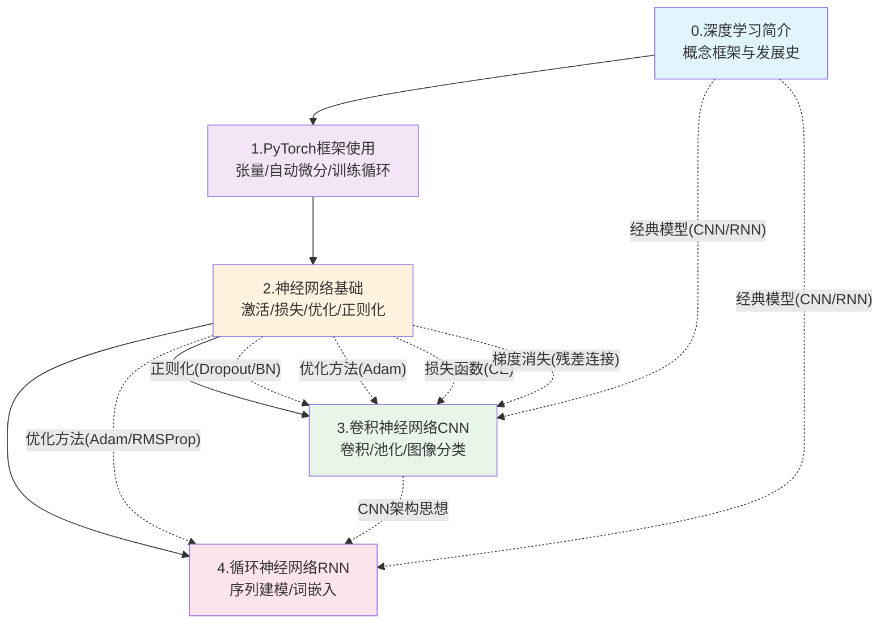

# 深度学习知识地图

> 本知识地图覆盖深度学习系列全部笔记的核心概念与知识关联。当前已完成 5 篇增强版笔记。2025-07-06 整合黑马笔记遗漏内容：大模型应用、PyTorch环境安装、张量索引、one-hot编码、完整Model类示例。
>
> **使用方式**：
> - 想快速查某个概念 -> 看「概念速查索引」按类别检索
> - 想知道该按什么顺序学 -> 看「学习路径」的阶段规划
> - 想快速调用 PyTorch API -> 看「PyTorch API 速查表」
> - 想避开常见坑 -> 看「FAQ」高频问题

---

## 一、系列概览

| 序号 | 笔记名称 | 核心主题数 | 难度分布 | 关键词 |
|------|---------|-----------|---------|--------|
| 0 | [[0.深度学习简介（AI增强版）]] | 5 | 基础1/核心4 | 深度学习定义、特点、经典模型、应用场景、发展史 |
| 1 | [[1.PyTorch框架使用（AI增强版）]] | 10 | 基础2/核心4/难点3 | 张量、索引、自动微分、nn.Module、训练循环、环境安装 |
| 2 | [[2.神经网络基础（AI增强版）]] | 13 | 基础3/核心10 | 激活函数、损失函数、反向传播、优化方法、正则化 |
| 3 | [[3.卷积神经网络CNN（AI增强版）]] | 8 | 基础2/核心3/难点3 | 卷积层、池化层、经典网络、图像分类、过拟合解决 |
| 4 | [[4.循环神经网络RNN（AI增强版）]] | 7 | 基础1/核心4/难点2 | RNN原理、词嵌入、文本生成、循环层、序列建模 |

---

## 二、概念速查索引

### 2.1 深度学习基础概念

| 概念 | 一句话定义 | 来源 |
|------|-----------|------|
| **深度学习** | 基于多层人工神经网络的机器学习方法，通过逐层非线性变换自动从数据中学习层次化特征表示。 | [[0.深度学习简介（AI增强版）]] |
| **AI/ML/DL 关系** | AI 包含 ML，ML 包含 DL；深度学习是 ML 中最具表现力的子集。 | [[0.深度学习简介（AI增强版）]] |
| **端到端学习** | 原始数据输入到最终输出的完整映射由网络自动学习，无需人工设计特征。 | [[0.深度学习简介（AI增强版）]] |
| **自动特征提取** | 网络从数据中自动学习从低级到高级的特征，减少对领域专家知识的依赖。 | [[0.深度学习简介（AI增强版）]] |
| **层次化特征表示** | 浅层提取边缘/纹理 -> 中层组合为部件 -> 深层形成语义概念。 | [[0.深度学习简介（AI增强版）]] |
| **万能近似定理** | 具有足够宽度的单隐藏层前馈网络可以以任意精度逼近任意连续函数。 | [[2.神经网络基础（AI增强版）]] |
| **非线性激活** | 打破线性变换的叠加等价性，使多层网络能拟合任意复杂函数。 | [[2.神经网络基础（AI增强版）]] |

### 2.2 深度学习特点与挑战

| 概念 | 一句话定义 | 来源 |
|------|-----------|------|
| **多层非线性变换** | 每个隐藏层对输入进行线性变换 + 非线性激活函数处理，使网络能拟合任意复杂函数。 | [[0.深度学习简介（AI增强版）]] |
| **大数据驱动** | 模型参数量巨大，需要海量数据训练，效果随数据量增长持续提升。 | [[0.深度学习简介（AI增强版）]] |
| **强算力依赖** | 训练深层网络需要大量矩阵运算，依赖 GPU/TPU 并行计算。 | [[0.深度学习简介（AI增强版）]] |
| **梯度消失** | 反向传播时梯度逐层相乘趋近于 0，底层参数无法更新。Sigmoid 最大导数仅 0.25，L 层后梯度缩放为 (0.25)^L。 | [[2.神经网络基础（AI增强版）]] |
| **梯度爆炸** | 反向传播时梯度逐层相乘指数膨胀，训练不稳定。 | [[0.深度学习简介（AI增强版）]] |
| **黑箱问题** | 深度学习内部决策过程难以被人理解，可解释性差。 | [[0.深度学习简介（AI增强版）]] |
| **过拟合 vs 欠拟合** | 过拟合是训练好但测试差（学太死），欠拟合是训练和测试都差（学不够）。 | [[0.深度学习简介（AI增强版）]] |
| **偏差-方差权衡** | 模型复杂度从低到高，测试误差先降后升呈 U 形曲线，最优模型在最低点处。 | [[3.卷积神经网络CNN（AI增强版）]] |

### 2.3 经典深度学习模型

| 概念 | 一句话定义 | 来源 |
|------|-----------|------|
| **CNN（卷积神经网络）** | 利用局部感受野和参数共享处理空间数据（图像），通过卷积+池化+全连接完成分类。 | [[0.深度学习简介（AI增强版）]] |
| **RNN（循环神经网络）** | 隐藏状态在时间步之间传递，处理序列数据（文本/语音），代表模型有 LSTM、GRU。 | [[0.深度学习简介（AI增强版）]] |
| **自编码器（Autoencoder）** | 编码器（压缩）+ 解码器（重建），通过无监督学习发现数据的有效低维表示。 | [[0.深度学习简介（AI增强版）]] |
| **GAN（生成对抗网络）** | 生成器（造假）与判别器（辨真）对抗训练，生成器逐渐学会生成逼真样本。 | [[0.深度学习简介（AI增强版）]] |
| **Transformer** | 基于自注意力机制的架构，动态关注输入序列不同部分，已成为当前最核心的基础架构。 | [[0.深度学习简介（AI增强版）]] |
| **扩散模型（Diffusion）** | 通过逐步去噪从随机噪声生成数据，正在成为图像/视频生成的新范式。 | [[0.深度学习简介（AI增强版）]] |

### 2.4 深度学习应用领域

| 概念 | 一句话定义 | 来源 |
|------|-----------|------|
| **计算机视觉（CV）** | 图像分类、目标检测、语义分割、人脸识别等视觉任务。 | [[0.深度学习简介（AI增强版）]] |
| **自然语言处理（NLP）** | 机器翻译、文本生成、情感分析、问答系统等语言任务。 | [[0.深度学习简介（AI增强版）]] |
| **推荐系统** | 个性化推荐、点击率预估，根据用户历史行为推荐内容/商品。 | [[0.深度学习简介（AI增强版）]] |

#### 大模型应用

| 概念 | 一句话定义 | 来源 |
|------|-----------|------|
| **Prompt Engineering** | 设计高效输入提示词引导大模型产生期望输出，无需修改模型参数即可适配任务。 | [[0.深度学习简介（AI增强版）]] |
| **RAG（检索增强生成）** | 将外部知识检索与大模型生成结合，解决知识时效性和幻觉问题。 | [[0.深度学习简介（AI增强版）]] |
| **Fine-Tuning（微调）** | 在预训练大模型基础上用特定领域数据有监督微调，适配下游任务。 | [[0.深度学习简介（AI增强版）]] |
| **RLHF** | 人类反馈强化学习，通过人类偏好数据对大模型输出进行对齐优化。 | [[0.深度学习简介（AI增强版）]] |

### 2.5 PyTorch 框架核心

#### 张量操作

| 概念 | 一句话定义 | 来源 |
|------|-----------|------|
| **张量（Tensor）** | PyTorch 的核心数据结构，多维数组的泛化，支持 GPU 加速和自动微分。 | [[1.PyTorch框架使用（AI增强版）]] |
| **张量创建** | 通过 `torch.tensor()` 从列表/ndarray 创建，或用 `zeros/ones/rand/randn` 创建特殊张量。 | [[1.PyTorch框架使用（AI增强版）]] |
| **Tensor 与 NumPy 互转** | `tensor.numpy()` 转 NumPy，`torch.from_numpy()` 转 Tensor，默认共享内存。 | [[1.PyTorch框架使用（AI增强版）]] |
| **张量数值计算** | 四则运算（逐元素）、矩阵乘法（`@` / `torch.mm`）、数学函数（sum/mean/max/clamp）。 | [[1.PyTorch框架使用（AI增强版）]] |
| **张量形状操作** | `reshape/view`（变形）、`squeeze/unsqueeze`（增减维度）、`transpose/permute`（转置/重排）。 | [[1.PyTorch框架使用（AI增强版）]] |
| **张量拼接** | `torch.cat()` 沿已有维度拼接（不增维），`torch.stack()` 沿新维度堆叠（增一维）。 | [[1.PyTorch框架使用（AI增强版）]] |
| **张量索引** | 行列索引 `data[i]`、范围索引 `data[start:end]`、布尔索引 `data[data>5]`、列表索引 `data[[i,j]]`。 | [[1.PyTorch框架使用（AI增强版）]] |
| **原地操作** | 带 `_` 后缀的方法原地修改数据，但在 `requires_grad=True` 的张量上会破坏计算图。 | [[1.PyTorch框架使用（AI增强版）]] |
| **共享内存机制** | GPU 上的 Tensor 需先 `.cpu()` 再 `.numpy()`；`.detach()` 可剥离计算图。索引结果也与原张量共享内存。 | [[1.PyTorch框架使用（AI增强版）]] |
| **张量类型转换** | `data.type(torch.LongTensor)` 或快捷方法 `.double()` / `.float()` / `.int()` / `.long()`。 | [[1.PyTorch框架使用（AI增强版）]] |
| **PyTorch环境安装** | conda创建隔离环境、pip安装torch、CUDA版本匹配验证。 | [[1.PyTorch框架使用（AI增强版）]] |

#### 自动微分

| 概念 | 一句话定义 | 来源 |
|------|-----------|------|
| **自动微分（Autograd）** | PyTorch 通过 `autograd` 模块自动计算梯度，构建有向无环计算图（DAG）。 | [[1.PyTorch框架使用（AI增强版）]] |
| **requires_grad** | 设置张量是否需要梯度追踪，是 autograd 构建计算图的开关。 | [[1.PyTorch框架使用（AI增强版）]] |
| **backward()** | 从标量张量出发沿计算图反向传播，自动计算每个叶子节点的梯度。 | [[1.PyTorch框架使用（AI增强版）]] |
| **梯度累积** | PyTorch 默认梯度是累加的，每个训练 step 前必须手动清零 `optimizer.zero_grad()`。 | [[1.PyTorch框架使用（AI增强版）]] |
| **torch.no_grad()** | 推理阶段禁用梯度追踪，节省显存约 50% 并加速推理。 | [[1.PyTorch框架使用（AI增强版）]] |
| **链式法则** | 自动微分的底层原理，从输出端沿计算图反向逐步乘以局部导数。 | [[1.PyTorch框架使用（AI增强版）]] |

#### 模型构建与训练

| 概念 | 一句话定义 | 来源 |
|------|-----------|------|
| **nn.Module** | PyTorch 中所有神经网络模块的基类，通过 `forward()` 方法定义前向传播逻辑。 | [[1.PyTorch框架使用（AI增强版）]] |
| **nn.Linear** | 全连接层，执行 `y = xW^T + b`，参数量 = `(in_features + 1) * out_features`。 | [[1.PyTorch框架使用（AI增强版）]] |
| **nn.Sequential** | 按顺序包装多个层的容器，适合线性堆叠的简单网络。 | [[2.神经网络基础（AI增强版）]] |
| **训练四步骤** | `zero_grad()` 清空梯度 -> 前向传播 -> `backward()` 反向传播 -> `optimizer.step()` 更新参数。 | [[1.PyTorch框架使用（AI增强版）]] |
| **model.train() / model.eval()** | 训练模式启用 Dropout 和 BatchNorm 训练行为，评估模式关闭 Dropout 使用全局统计量。 | [[1.PyTorch框架使用（AI增强版）]] |

### 2.6 神经网络核心组件

#### 激活函数

| 概念 | 一句话定义 | 来源 |
|------|-----------|------|
| **Sigmoid** | 输出 (0,1)，适合二分类输出层，深层网络中易梯度消失（最大导数 0.25）。 | [[2.神经网络基础（AI增强版）]] |
| **Tanh** | 输出 (-1,1)，零中心化，比 Sigmoid 更适合隐藏层和 RNN，但仍有梯度消失。 | [[2.神经网络基础（AI增强版）]] |
| **ReLU** | `max(0, x)`，计算高效、正区间无梯度消失、稀疏激活，隐藏层默认首选。 | [[2.神经网络基础（AI增强版）]] |
| **SoftMax** | 输出概率分布（和为 1），适合多分类输出层，配合交叉熵损失使用。 | [[2.神经网络基础（AI增强版）]] |
| **Leaky ReLU** | `max(0.01x, x)`，负半区保留微小梯度，避免神经元死亡。 | [[2.神经网络基础（AI增强版）]] |
| **GELU** | `x * Phi(x)`，被 Transformer 和 GPT 系列广泛采用。 | [[2.神经网络基础（AI增强版）]] |
| **Swish** | `x * sigma(beta*x)`，在深层网络中表现优于 ReLU。 | [[2.神经网络基础（AI增强版）]] |
| **死亡ReLU** | ReLU 负半区梯度恒为 0，当输入大面积落入负半区时神经元永久失活。 | [[2.神经网络基础（AI增强版）]] |

#### 参数初始化

| 概念 | 一句话定义 | 来源 |
|------|-----------|------|
| **全零初始化** | 所有权重设为 0，导致对称性问题，所有神经元学到相同特征，绝对禁止。 | [[2.神经网络基础（AI增强版）]] |
| **Xavier 初始化** | 保持各层方差一致，适合 Tanh/Sigmoid 激活，方差为 `2/(n_in + n_out)`。 | [[2.神经网络基础（AI增强版）]] |
| **Kaiming 初始化** | 考虑 ReLU 半区置零特性，适合 ReLU 激活，方差为 `2/n_in`。 | [[2.神经网络基础（AI增强版）]] |
| **对称性问题** | 全相同初始化使同层神经元接收相同输入、计算相同梯度，退化为更窄的单层网络。 | [[2.神经网络基础（AI增强版）]] |
| **nn.Module 自定义模型** | 继承 `nn.Module`，在 `__init__` 中定义层、在 `forward` 中定义前向传播流程。 | [[2.神经网络基础（AI增强版）]] |
| **模型参数计算** | 第n层参数量 = n个神经元 × (m个输入权重 + 1个偏置) = n × m + n。 | [[2.神经网络基础（AI增强版）]] |
| **named_parameters()** | 遍历模型所有可学习参数，返回 `(name, Parameter)` 元组。 | [[2.神经网络基础（AI增强版）]] |

### 2.7 损失函数

| 概念 | 一句话定义 | 来源 |
|------|-----------|------|
| **损失函数** | 衡量模型预测值与真实标签差距的标量函数，训练的目标是最小化它。 | [[2.神经网络基础（AI增强版）]] |
| **交叉熵损失（CE）** | 衡量预测概率分布与真实分布的差异，多分类任务的标准损失函数。 | [[2.神经网络基础（AI增强版）]] |
| **CrossEntropyLoss** | PyTorch 多分类损失，内含 LogSoftMax，输入应为原始 logits 而非概率。 | [[2.神经网络基础（AI增强版）]] |
| **BCEWithLogitsLoss** | 二分类损失，内含 Sigmoid + Log，数值更稳定，直接传入 logits。 | [[2.神经网络基础（AI增强版）]] |
| **MSE（均方误差）** | 对大误差二次惩罚，对异常值敏感，通用回归损失函数。 | [[2.神经网络基础（AI增强版）]] |
| **MAE（平均绝对误差）** | 对大误差线性惩罚，对异常值鲁棒，但零点不可导。 | [[2.神经网络基础（AI增强版）]] |
| **Smooth L1（Huber Loss）** | 小误差用二次、大误差用绝对值，结合两者优点，目标检测标配。 | [[2.神经网络基础（AI增强版）]] |
| **one-hot 编码** | 将类别标签转为向量形式，正确类别位置为1其余为0，是交叉熵损失的标签表示基础。 | [[2.神经网络基础（AI增强版）]] |

### 2.8 梯度下降与反向传播

| 概念 | 一句话定义 | 来源 |
|------|-----------|------|
| **梯度下降** | 沿损失函数梯度的反方向迭代更新参数以最小化损失：`theta = theta - lr * grad`。 | [[2.神经网络基础（AI增强版）]] |
| **Epoch** | 遍历一次完整训练集，一个 Epoch = 所有样本参与一次训练。 | [[2.神经网络基础（AI增强版）]] |
| **Batch** | 一次前向/反向传播使用的样本子集，典型大小 32/64/128/256。 | [[2.神经网络基础（AI增强版）]] |
| **学习率** | 参数更新步长，过大导致震荡发散，过小导致收敛极慢。 | [[2.神经网络基础（AI增强版）]] |
| **BGD/SGD/Mini-batch** | 批量梯度下降用全数据（稳定但慢），随机梯度下降用单样本（快但噪），小批量兼顾两者。 | [[2.神经网络基础（AI增强版）]] |
| **反向传播（BP）** | 利用链式法则从输出层向输入层逐层计算损失函数对每个参数的梯度。 | [[2.神经网络基础（AI增强版）]] |
| **计算图（DAG）** | PyTorch 在前向传播时动态构建的有向无环图，反向传播沿其反向遍历计算梯度。 | [[2.神经网络基础（AI增强版）]] |
| **多路径梯度累加** | 当一个参数被多条路径使用时（如残差连接），各路径梯度自动累加。 | [[2.神经网络基础（AI增强版）]] |

### 2.9 优化方法

| 概念 | 一句话定义 | 来源 |
|------|-----------|------|
| **指数加权平均（EWA）** | Momentum 和 Adam 的理论基础，`v_t = beta * v_{t-1} + (1-beta) * theta_t`。 | [[2.神经网络基础（AI增强版）]] |
| **Momentum（动量法）** | 引入速度变量积累历史梯度方向，一致时加速、变化时减速，物理类比球从山坡滚下。 | [[2.神经网络基础（AI增强版）]] |
| **AdaGrad** | 为每个参数维护独立学习率，频繁更新者学习率自动减小，但学习率单调递减。 | [[2.神经网络基础（AI增强版）]] |
| **RMSProp** | 改进 AdaGrad，用梯度平方的指数加权平均替代累加，解决学习率持续衰减问题。 | [[2.神经网络基础（AI增强版）]] |
| **Adam** | 结合 Momentum（一阶矩）和 RMSProp（二阶矩），自适应学习率，工业界默认首选优化器。 | [[2.神经网络基础（AI增强版）]] |
| **AdamW** | Adam 的改进版本，将权重衰减从梯度更新中解耦，Transformer 训练标配。 | [[2.神经网络基础（AI增强版）]] |

### 2.10 学习率调度

| 概念 | 一句话定义 | 来源 |
|------|-----------|------|
| **学习率衰减** | 训练过程中动态降低学习率，初期快速探索、后期精细收敛。 | [[2.神经网络基础（AI增强版）]] |
| **StepLR** | 每固定步数将学习率乘以衰减系数 gamma。 | [[2.神经网络基础（AI增强版）]] |
| **MultiStepLR** | 在指定 epoch 列表处衰减学习率。 | [[2.神经网络基础（AI增强版）]] |
| **ExponentialLR** | 每个 epoch 将学习率乘以固定衰减系数，连续平滑下降。 | [[2.神经网络基础（AI增强版）]] |
| **CosineAnnealingLR** | 学习率按余弦曲线平滑下降。 | [[2.神经网络基础（AI增强版）]] |
| **ReduceLROnPlateau** | 验证集损失停滞时自动衰减学习率。 | [[2.神经网络基础（AI增强版）]] |

### 2.11 正则化技术

| 概念 | 一句话定义 | 来源 |
|------|-----------|------|
| **Dropout** | 训练时以概率 p 随机将部分神经元输出置零，推理时不丢弃，等价于训练多个子网络的集成。 | [[2.神经网络基础（AI增强版）]] |
| **Batch Normalization（BN）** | 对每个 mini-batch 数据做标准化，稳定每层输入分布，加速收敛、允许更大学习率。 | [[2.神经网络基础（AI增强版）]] |
| **L2 正则化（权重衰减）** | 在损失函数中惩罚大权重，通过优化器的 `weight_decay` 参数设置。 | [[2.神经网络基础（AI增强版）]] |
| **L1 正则化** | 促进权重稀疏，可用于特征选择，PyTorch 需手动实现。 | [[2.神经网络基础（AI增强版）]] |
| **Early Stopping** | 监控验证集性能，连续多个 epoch 不提升时停止训练，防止过度训练。 | [[2.神经网络基础（AI增强版）]] |
| **数据增强** | 增加训练数据多样性（如随机裁剪/翻转），图像任务防过拟合首选手段。 | [[3.卷积神经网络CNN（AI增强版）]] |
| **Layer Normalization** | 按样本归一化而非按 batch，用于 Transformer/RNN。 | [[2.神经网络基础（AI增强版）]] |
| **Group Normalization** | 按 channel group 归一化，适用于小 batch 场景。 | [[2.神经网络基础（AI增强版）]] |

### 2.12 CNN 核心概念

#### 图像基础

| 概念 | 一句话定义 | 来源 |
|------|-----------|------|
| **图像数字化** | 计算机将图像视为多维数组，灰度图为 HxW，RGB 图为 HxWx3，PyTorch 格式为 [C, H, W]。 | [[3.卷积神经网络CNN（AI增强版）]] |
| **像素值归一化** | 将 uint8 [0,255] 像素值转为 float [0,1] 并标准化，输入网络前必须做。 | [[3.卷积神经网络CNN（AI增强版）]] |

#### 卷积操作

| 概念 | 一句话定义 | 来源 |
|------|-----------|------|
| **CNN** | 专门处理网格拓扑数据（如图像）的网络，利用局部感受野和参数共享大幅减少参数量。 | [[3.卷积神经网络CNN（AI增强版）]] |
| **局部感受野** | 每个神经元只关注输入的局部区域，捕获边缘、纹理等局部特征。 | [[3.卷积神经网络CNN（AI增强版）]] |
| **参数共享** | 同一卷积核在整张图像上滑动复用，大幅减少参数数量，提高平移不变性。 | [[3.卷积神经网络CNN（AI增强版）]] |
| **卷积核/滤波器** | 在输入上滑动计算点积的矩阵，每个卷积核学习检测一种特定的局部模式。 | [[3.卷积神经网络CNN（AI增强版）]] |
| **Padding** | 在输入周围补零，保持输出尺寸不变（kernel=3 时 padding=1 保持尺寸）。 | [[3.卷积神经网络CNN（AI增强版）]] |
| **Stride** | 卷积核每次滑动的距离，stride=2 使输出尺寸减半。 | [[3.卷积神经网络CNN（AI增强版）]] |
| **特征图大小公式** | `O = floor((I - K + 2P) / S) + 1`，I=输入, K=核, P=Padding, S=Stride。 | [[3.卷积神经网络CNN（AI增强版）]] |
| **多通道卷积** | 卷积核在所有输入通道上分别计算后求和，输出通道数由卷积核个数决定。 | [[3.卷积神经网络CNN（AI增强版）]] |
| **1x1 卷积** | 在通道维度上进行线性组合，用于跨通道信息融合和升维/降维。 | [[3.卷积神经网络CNN（AI增强版）]] |
| **空洞卷积** | 卷积核元素间插入空洞，不增加参数量扩大感受野，用于语义分割。 | [[3.卷积神经网络CNN（AI增强版）]] |

#### 池化操作

| 概念 | 一句话定义 | 来源 |
|------|-----------|------|
| **池化层** | 对特征图空间降维，减少参数量和计算量，增强平移不变性，无可学习参数。 | [[3.卷积神经网络CNN（AI增强版）]] |
| **最大池化** | 取局部区域最大值，保留最显著特征，分类网络最常用。 | [[3.卷积神经网络CNN（AI增强版）]] |
| **平均池化** | 取局部区域平均值，保留整体信息，用于分割网络和全局平均池化。 | [[3.卷积神经网络CNN（AI增强版）]] |
| **全局平均池化（GAP）** | 将每个通道整个特征图平均为一个值，替代 Flatten+全连接层，大幅减少参数。 | [[3.卷积神经网络CNN（AI增强版）]] |

#### 经典 CNN 架构

| 概念 | 一句话定义 | 来源 |
|------|-----------|------|
| **LeNet-5** | 1998 年首个成功 CNN，5 层可学习，用于手写数字识别。 | [[3.卷积神经网络CNN（AI增强版）]] |
| **AlexNet** | 2012 年引爆深度学习热潮，ReLU 激活 + Dropout + GPU 训练 + 数据增强。 | [[3.卷积神经网络CNN（AI增强版）]] |
| **VGGNet** | 2014 年用 3x3 小卷积核堆叠证明"深而窄"有效，结构简洁优雅。 | [[3.卷积神经网络CNN（AI增强版）]] |
| **GoogLeNet** | 2014 年 Inception 模块，多尺度并行卷积，1x1 卷积降维。 | [[3.卷积神经网络CNN（AI增强版）]] |
| **ResNet** | 2015 年残差连接 `y = F(x) + x`，解决深层网络退化问题，使 152+ 层可训练。 | [[3.卷积神经网络CNN（AI增强版）]] |
| **DenseNet** | 2017 年密集连接，每层与所有前层连接，特征复用更充分。 | [[3.卷积神经网络CNN（AI增强版）]] |

#### CNN 实战

| 概念 | 一句话定义 | 来源 |
|------|-----------|------|
| **CIFAR10** | 经典图像分类 benchmark，10 类 32x32 RGB 图像，5 万训练 + 1 万测试。 | [[3.卷积神经网络CNN（AI增强版）]] |
| **CNN 分类网络结构** | 卷积块(Conv+ReLU+Pool) -> 展平(Flatten) -> 全连接层(FC) -> Softmax 输出。 | [[3.卷积神经网络CNN（AI增强版）]] |
| **特征图可视化** | 取出卷积层中间输出并绘制，浅层学边缘/颜色，深层学语义部件。 | [[3.卷积神经网络CNN（AI增强版）]] |
| **DataLoader** | 批量加载、打乱、多进程读取数据的工具，核心参数 batch_size/shuffle/num_workers。 | [[3.卷积神经网络CNN（AI增强版）]] |

### 2.13 RNN 核心概念

| 概念 | 一句话定义 | 来源 |
|------|-----------|------|
| **RNN（循环神经网络）** | 通过隐藏状态在时间步之间传递信息，专门处理序列数据（文本/语音/时序）。 | [[4.循环神经网络RNN（AI增强版）]] |
| **隐藏状态（Hidden State）** | RNN 的"记忆"，编码从序列开始到当前位置的所有信息，逐时间步更新。 | [[4.循环神经网络RNN（AI增强版）]] |
| **时间步展开** | 同一组权重在每个时间步重复使用，使网络能处理任意长度的序列。 | [[4.循环神经网络RNN（AI增强版）]] |
| **词嵌入（Word Embedding）** | 将离散的词索引映射为低维稠密向量，是连接词汇离散世界与神经网络连续世界的桥梁。 | [[4.循环神经网络RNN（AI增强版）]] |
| **nn.Embedding** | PyTorch 词嵌入层，输入 LongTensor 词索引，输出对应稠密向量。 | [[4.循环神经网络RNN（AI增强版）]] |
| **nn.RNN** | PyTorch RNN 层，参数 input_size/hidden_size/num_layers/batch_first。 | [[4.循环神经网络RNN（AI增强版）]] |
| **batch_first** | True 时输入输出形状为 (batch, seq, features)，False 时为 (seq, batch, features)。 | [[4.循环神经网络RNN（AI增强版）]] |
| **教师强制（Teacher Forcing）** | 训练时每个时间步输入使用真实标签而非模型预测，加速收敛但导致暴露偏差。 | [[4.循环神经网络RNN（AI增强版）]] |
| **自回归生成** | 预测时用模型自身上一时间步的输出作为下一时间步的输入，逐字符生成文本。 | [[4.循环神经网络RNN（AI增强版）]] |
| **温度参数（Temperature）** | 控制生成文本随机性，T→0 确定性输出，T=1 标准采样，T→∞ 接近随机。 | [[4.循环神经网络RNN（AI增强版）]] |
| **梯度裁剪** | 将梯度范数限制在阈值内，防止 RNN 训练时的梯度爆炸导致 NaN。 | [[4.循环神经网络RNN（AI增强版）]] |
| **字符级建模** | 以单个字符为基本单位，词表小无 OOV，但序列长、语义信息有限。 | [[4.循环神经网络RNN（AI增强版）]] |
| **LSTM** | 长短期记忆网络，引入遗忘门/输入门/输出门，解决基础 RNN 的梯度消失问题。 | [[4.循环神经网络RNN（AI增强版）]] |
| **GRU** | 门控循环单元，LSTM 的轻量化版本，用重置门/更新门实现类似效果。 | [[4.循环神经网络RNN（AI增强版）]] |
| **暴露偏差（Exposure Bias）** | 训练时用真实标签输入、推理时用模型预测输入，两者不一致导致误差累积。 | [[4.循环神经网络RNN（AI增强版）]] |

### 2.14 深度学习发展史

| 年份 | 事件 | 意义 | 来源 |
|------|------|------|------|
| 1943 | M-P 神经元模型 | 人工神经网络的数学基础 | [[0.深度学习简介（AI增强版）]] |
| 1957 | 感知机（Perceptron） | 第一个可学习的神经网络模型 | [[0.深度学习简介（AI增强版）]] |
| 1986 | BP 算法 | 解决多层网络训练问题，深度学习成为可能 | [[0.深度学习简介（AI增强版）]] |
| 1998 | LeNet-5 | 卷积神经网络经典实现，手写数字识别 | [[0.深度学习简介（AI增强版）]] |
| 2006 | 深度信念网络（DBN） | 深度学习复兴标志，逐层预训练策略 | [[0.深度学习简介（AI增强版）]] |
| 2012 | AlexNet | 深度学习在 CV 领域突破，引爆热潮 | [[0.深度学习简介（AI增强版）]] |
| 2014 | GAN | 开启生成式 AI 新方向 | [[0.深度学习简介（AI增强版）]] |
| 2015 | ResNet | 残差连接解决深层网络退化 | [[0.深度学习简介（AI增强版）]] |
| 2017 | Transformer | 自注意力机制改变 NLP 范式 | [[0.深度学习简介（AI增强版）]] |
| 2018 | BERT / GPT-1 | 预训练+微调范式确立，大模型时代开启 | [[0.深度学习简介（AI增强版）]] |
| 2020 | GPT-3 | 1750 亿参数，展示少样本学习能力 | [[0.深度学习简介（AI增强版）]] |
| 2022 | ChatGPT | 大语言模型走向大众，生成式 AI 元年 | [[0.深度学习简介（AI增强版）]] |

---

## 三、核心流程

### 3.1 神经网络训练完整流程

```python
数据准备 -> 模型定义 -> 损失函数与优化器 -> 训练循环 -> 评估 -> 部署

训练循环（每个 Epoch 重复执行）：
  for batch in dataloader:
      1. optimizer.zero_grad()          清空梯度
      2. output = model(batch_x)        前向传播
      3. loss = criterion(output, y)    计算损失
      4. loss.backward()                反向传播
      5. optimizer.step()               参数更新
  scheduler.step()                       学习率衰减（Epoch 级别）
```

### 3.2 CNN 图像分类流程

```python
图像加载 -> transforms 预处理 -> DataLoader 批量加载
  -> Conv2d + BN + ReLU + MaxPool2d (特征提取)
  -> Conv2d + BN + ReLU + MaxPool2d (特征提取)
  -> Flatten 展平
  -> Linear + Dropout + ReLU (分类决策)
  -> Linear (输出 logits)
  -> CrossEntropyLoss + Adam 优化
```

### 3.3 数据流形状变化（CIFAR10 示例）

```text
输入:        [B, 3, 32, 32]       (RGB 图像)
Conv1+BN+ReLU:  [B, 32, 32, 32]   (32 个特征图)
Pool1:       [B, 32, 16, 16]      (空间减半)
Conv2+BN+ReLU:  [B, 64, 16, 16]   (64 个特征图)
Pool2:       [B, 64, 8, 8]        (空间再减半)
Conv3+BN+ReLU:  [B, 64, 8, 8]     (64 个特征图)
Pool3:       [B, 64, 4, 4]        (空间再减半)
Flatten:     [B, 1024]            (展平)
FC1+ReLU:    [B, 64]              (全连接)
FC2:         [B, 10]              (10 类输出)
```

---

## 四、核心矛盾

| 矛盾对 | 核心冲突 | 解决方案 |
|--------|---------|---------|
| **欠拟合 vs 过拟合** | 模型太简单学不够 vs 太复杂死记硬背 | 增减网络容量、正则化、数据增强、早停法 |
| **梯度消失 vs 梯度爆炸** | 深层网络梯度逐层衰减 vs 指数膨胀 | ReLU 激活、残差连接、BatchNorm、梯度裁剪 |
| **计算量 vs 精度** | 模型越大精度越高但计算成本也越高 | 模型压缩（量化/剪枝/蒸馏）、知识蒸馏 |
| **训练速度 vs 收敛质量** | 大学习率快但震荡，小学习率稳但慢 | 学习率调度（StepLR/CosineAnnealing）、Adam 自适应 |
| **偏差 vs 方差** | 简单模型偏差大、复杂模型方差大 | U 形曲线找最优点，集成学习降低方差 |
| **参数量 vs 泛化能力** | 参数多不一定泛化好，可能过拟合 | 正则化（Dropout/L2）、数据增强、迁移学习 |
| **局部感受野 vs 全局上下文** | CNN 局部性强但全局建模弱 | Transformer 自注意力机制、ViT |
| **训练效率 vs 内存占用** | 反向传播需存储中间值，深层网络显存大 | 梯度检查点（Gradient Checkpointing）、混合精度训练 |

---

## 五、知识依赖关系



**关键依赖说明**：
- 0 -> 1：深度学习概念框架是学习 PyTorch 的前提
- 1 -> 2：张量操作和自动微分是理解神经网络训练的基础
- 2 -> 3/4：神经网络通用知识（激活函数、损失、优化、正则化）是 CNN 和 RNN 的共同基础
- 2 -> 3（虚线）：正则化、优化方法、损失函数等通用技术被 CNN 直接复用
- 3 -> 4（虚线）：CNN 的架构设计思想（深层网络、残差连接）对 RNN/LSTM/Transformer 有借鉴意义

---

## 六、学习路径建议

### 阶段 1：建立认知框架（入门）

**目标**：理解深度学习的全貌，建立概念框架。

**必读**：[[0.深度学习简介（AI增强版）]]
- 必须掌握：AI/ML/DL 三层关系与深度学习定义
- 必须掌握：深度学习四大特点（非线性变换、自动特征提取、大数据驱动、强算力依赖）
- 必须掌握：五大经典模型（CNN/RNN/Autoencoder/GAN/Transformer）的核心思想与适用场景
- 必须掌握：三大应用领域（CV/NLP/推荐系统）
- 必须掌握：发展史关键里程碑（M-P -> BP -> AlexNet -> Transformer -> ChatGPT）
- **预计时间**：2~3 小时

### 阶段 2：掌握工具基础（工具）

**目标**：熟练使用 PyTorch 进行张量计算和模型训练。

**必读**：[[1.PyTorch框架使用（AI增强版）]]
- 必须掌握：张量创建、类型转换、数值计算
- 必须掌握：形状操作（reshape/view/squeeze/unsqueeze/transpose/permute）
- 必须掌握：自动微分（requires_grad/backward/zero_grad/no_grad）
- 必须掌握：nn.Module 模型定义与训练四步骤
- 建议动手：完成线性回归实战代码
- **预计时间**：4~6 小时

### 阶段 3：掌握通用知识（核心）

**目标**：理解神经网络的通用原理，为后续 CNN/RNN 打下基础。

**必读**：[[2.神经网络基础（AI增强版）]]
- 必须掌握：激活函数选择策略（隐藏层 ReLU / 二分类 Sigmoid / 多分类 SoftMax）
- 必须掌握：参数初始化（禁止全零、Xavier vs Kaiming）
- 必须掌握：损失函数选择（分类用 CE / 回归用 MSE 或 Smooth L1）
- 必须掌握：梯度下降三种变体（BGD/SGD/Mini-batch）
- 必须掌握：反向传播 BP 算法（链式法则、计算图）
- 必须掌握：优化器演进（SGD -> Momentum -> Adam）
- 必须掌握：正则化方法（Dropout/BN/L2/早停法）
- 建议动手：完成手机价格分类实战
- **预计时间**：6~8 小时

### 阶段 4：专项模型深入（进阶）

**目标**：掌握 CNN 的核心原理和实战能力。

**必读**：[[3.卷积神经网络CNN（AI增强版）]]
- 必须掌握：卷积层原理（卷积核滑动、Padding、Stride、多通道）
- 必须掌握：特征图大小公式 `O = floor((I-K+2P)/S) + 1`
- 必须掌握：池化层（最大池化 vs 平均池化 vs GAP）
- 必须掌握：经典架构演进（LeNet -> AlexNet -> VGG -> ResNet）
- 必须掌握：过拟合解决方案（数据增强/Dropout/L2/早停/BN）
- 建议动手：完成 CIFAR10 图像分类实战
- **预计时间**：6~8 小时

### 阶段 5：序列模型拓展（进阶）

**必读**：[[4.循环神经网络RNN（AI增强版）]]
- 必须掌握：RNN 核心原理（隐藏状态传递、时间步展开）
- 必须掌握：词嵌入层（nn.Embedding）将离散词索引映射为稠密向量
- 必须掌握：PyTorch nn.RNN API（input_size/hidden_size/num_layers/batch_first）
- 必须掌握：文本生成全流程（数据准备 → 词表构建 → 模型搭建 → 训练 → 生成）
- 必须掌握：教师强制（Teacher Forcing）vs 自回归生成
- 了解：LSTM/GRU 解决梯度消失、双向 RNN、温度参数控制生成多样性
- 建议动手：完成周杰伦歌词文本生成实战
- **预计时间**：4~6 小时

---

## 七、PyTorch API 速查

### 7.1 张量操作

| 操作 | API | 说明 |
|------|-----|------|
| 创建张量 | `torch.tensor(data, dtype, device)` | 从列表/ndarray 创建 |
| 全零/全一 | `torch.zeros(shape)` / `torch.ones(shape)` | 特殊张量 |
| 随机张量 | `torch.rand(shape)` / `torch.randn(shape)` | 均匀/正态分布 |
| NumPy 互转 | `tensor.numpy()` / `torch.from_numpy(arr)` | 共享内存 |
| 提取标量 | `tensor.item()` | 仅限单元素 |
| 形状变换 | `tensor.reshape(n, m)` / `tensor.view(n, m)` | view 要求连续 |
| 增减维度 | `tensor.squeeze()` / `tensor.unsqueeze(dim)` | 去除/添加长度为1的维度 |
| 转置 | `tensor.transpose(d1, d2)` / `tensor.permute(*dims)` | 两维交换/多维重排 |
| 拼接 | `torch.cat([a, b], dim)` / `torch.stack([a, b], dim)` | 沿已有维/新维拼接 |
| 矩阵乘法 | `a @ b` / `torch.mm(a, b)` / `torch.matmul(a, b)` | 非逐元素乘法 |
| GPU 迁移 | `tensor.to('cuda')` / `model.to(device)` | 设备转移 |

### 7.2 自动微分

| 操作 | API | 说明 |
|------|-----|------|
| 启用梯度 | `tensor.requires_grad_(True)` | 或创建时设置 |
| 反向传播 | `loss.backward()` | 从标量开始 |
| 查看梯度 | `tensor.grad` | 叶子节点 |
| 清空梯度 | `optimizer.zero_grad()` / `tensor.grad.zero_()` | 训练前必须 |
| 脱离计算图 | `tensor.detach()` | 用于评估/可视化 |
| 禁用梯度 | `with torch.no_grad():` | 推理时节省显存 |

### 7.3 网络层

| 层类型 | API | 说明 |
|--------|-----|------|
| 全连接层 | `nn.Linear(in_features, out_features)` | y = xW^T + b |
| 卷积层 | `nn.Conv2d(in_ch, out_ch, kernel_size, stride, padding)` | 图像特征提取 |
| 最大池化 | `nn.MaxPool2d(kernel_size, stride)` | 空间降维 |
| 平均池化 | `nn.AvgPool2d(kernel_size, stride)` | 保留整体信息 |
| 全局平均池化 | `nn.AdaptiveAvgPool2d(1)` | 替代 Flatten+FC |
| Dropout | `nn.Dropout(p)` | 训练时随机丢弃 |
| BatchNorm1d | `nn.BatchNorm1d(features)` | 全连接层后 |
| BatchNorm2d | `nn.BatchNorm2d(channels)` | 卷积层后 |
| Sequential | `nn.Sequential(layer1, layer2, ...)` | 线性堆叠容器 |

### 7.4 损失函数

| 任务 | API | 说明 |
|------|-----|------|
| 多分类 | `nn.CrossEntropyLoss()` | 输入 logits，内含 LogSoftMax |
| 二分类 | `nn.BCEWithLogitsLoss()` | 输入 logits，内含 Sigmoid |
| 回归 | `nn.MSELoss()` | 均方误差 |
| 回归 | `nn.L1Loss()` | 平均绝对误差 |
| 回归 | `nn.SmoothL1Loss()` | Huber Loss，目标检测常用 |

### 7.5 优化器与调度器

| 优化器 | API | 推荐场景 |
|--------|-----|---------|
| SGD | `optim.SGD(params, lr, momentum=0.9)` | 学术基线对比 |
| Adam | `optim.Adam(params, lr=0.001)` | 通用默认首选 |
| AdamW | `optim.AdamW(params, lr)` | Transformer/BERT |
| RMSProp | `optim.RMSprop(params, lr)` | RNN 训练 |

| 调度器 | API | 说明 |
|--------|-----|------|
| StepLR | `lr_scheduler.StepLR(opt, step_size, gamma)` | 固定间隔衰减 |
| MultiStepLR | `lr_scheduler.MultiStepLR(opt, milestones, gamma)` | 自定义里程碑 |
| CosineAnnealing | `lr_scheduler.CosineAnnealingLR(opt, T_max)` | 余弦退火 |
| ReduceLROnPlateau | `lr_scheduler.ReduceLROnPlateau(opt, mode)` | 验证停滞时衰减 |

---

## 八、FAQ（高频避坑指南）

| 问题 | 答案 | 详细位置 |
|------|------|----------|
| **深度学习一定比传统 ML 好吗？** | 不是。小数据、表格数据场景下 XGBoost/LightGBM 往往优于深度学习。 | [[0.深度学习简介（AI增强版）]] |
| **隐藏层该用什么激活函数？** | 默认用 ReLU。RNN 隐藏层用 Tanh，二分类输出用 Sigmoid，多分类输出用 SoftMax。 | [[2.神经网络基础（AI增强版）]] |
| **权重可以全零初始化吗？** | 绝对不可以。全零初始化导致对称性问题，所有神经元学到相同特征。用 Xavier/Kaiming 随机初始化。 | [[2.神经网络基础（AI增强版）]] |
| **CrossEntropyLoss 前需要加 SoftMax 吗？** | 不需要。CrossEntropyLoss 内含 LogSoftMax，再手动加会重复计算。输入直接传原始 logits。 | [[2.神经网络基础（AI增强版）]] |
| **忘了 zero_grad() 会怎样？** | 梯度会累积，参数更新方向错误，训练不收敛。把它作为训练循环第一步。 | [[1.PyTorch框架使用（AI增强版）]] |
| ***\*（逐元素）和 @（矩阵乘法）怎么区分？** | 星号是逐位相乘，艾特才是矩阵乘法。全连接层本质是矩阵乘法 `y = x @ W.T + b`。 | [[1.PyTorch框架使用（AI增强版）]] |
| **GPU 张量怎么转 NumPy？** | 不能直接 `.numpy()`，必须先 `.cpu()`。安全写法：`tensor.cpu().detach().numpy()`。 | [[1.PyTorch框架使用（AI增强版）]] |
| **Adam 和 SGD 怎么选？** | Adam 收敛快、调参简单，是工业默认首选。SGD 精细调参后精度可能更高，适合学术研究。先用 Adam 验证，再尝试 SGD。 | [[2.神经网络基础（AI增强版）]] |
| **BN 放在激活函数前还是后？** | 推荐放在 Linear/Conv 层之后、激活函数之前（Conv -> BN -> ReLU -> Pool）。 | [[2.神经网络基础（AI增强版）]] |
| **model.train() 和 model.eval() 忘了切换会怎样？** | 训练时若用 eval 模式，Dropout 不生效、BN 用全局统计量；推理时若用 train 模式，Dropout 继续丢弃、BN 用当前 batch 统计量，结果全部错误。 | [[3.卷积神经网络CNN（AI增强版）]] |
| **卷积层输出尺寸怎么算？** | `O = floor((I - K + 2P) / S) + 1`。kernel=3/padding=1/stride=1 保持尺寸不变，stride=2 减半。 | [[3.卷积神经网络CNN（AI增强版）]] |
| **全连接层输入维度不匹配怎么办？** | 在 forward() 中先 `print(x.shape)` 确认展平后维度，或用 `nn.AdaptiveAvgPool2d(1)` 固定输出。 | [[3.卷积神经网络CNN（AI增强版）]] |
| **训练损失出现 NaN 怎么办？** | 可能原因：学习率过大、梯度爆炸。解决方案：降低学习率、加入梯度裁剪 `clip_grad_norm_`。 | [[3.卷积神经网络CNN（AI增强版）]] |
| **BatchNorm 在小 batch 下效果差怎么办？** | batch_size < 8 时统计量不准确，改用 GroupNorm 或 LayerNorm。 | [[2.神经网络基础（AI增强版）]] |
| **如何判断过拟合还是欠拟合？** | 过拟合：训练好但测试差（差距大）。欠拟合：训练和测试都差。良好拟合：两者都高且差距小。 | [[3.卷积神经网络CNN（AI增强版）]] |
| **数据增强会改变标签吗？** | 不能。如对数字"6"做水平翻转变成"9"就改变了语义。增强操作需确保不改变标签含义。 | [[3.卷积神经网络CNN（AI增强版）]] |
| **测试集能用 fit_transform 吗？** | 严禁。测试集只能用训练集拟合好的参数做 transform，否则造成数据泄露。 | [[2.神经网络基础（AI增强版）]] |
| **ReLU 变体有哪些？什么时候用？** | Leaky ReLU（负区保留梯度）、PReLU（可学习参数）、ELU（负区有梯度且零中心化）、GELU（Transformer 用）、Swish（深层网络优于 ReLU）。 | [[2.神经网络基础（AI增强版）]] |
| **CNN 和 Transformer 的区别？** | CNN 依赖局部感受野逐层抽象，参数少但全局建模弱；Transformer 用自注意力直接建模全局依赖，但计算量大。ViT 正在部分替代 CNN。 | [[0.深度学习简介（AI增强版）]] |

---

## 九、标签云

```python
#深度学习 #神经网络 #PyTorch #CNN #RNN #Transformer
#张量 #自动微分 #nn.Module #计算图 #链式法则
#激活函数 #ReLU #Sigmoid #Tanh #SoftMax #GELU
#损失函数 #交叉熵 #MSE #MAE #HuberLoss
#梯度下降 #反向传播 #SGD #Momentum #Adam #AdamW
#学习率调度 #StepLR #CosineAnnealing #ReduceLROnPlateau
#正则化 #Dropout #BatchNorm #L2正则化 #数据增强 #早停法
#卷积层 #池化层 #Padding #Stride #特征图 #残差连接
#LeNet #AlexNet #VGG #ResNet #DenseNet
#图像分类 #CIFAR10 #目标检测 #语义分割
#过拟合 #欠拟合 #梯度消失 #梯度爆炸
#Xavier初始化 #Kaiming初始化
#GPU加速 #模型部署 #迁移学习
```

---

> **维护说明**：本文档随笔记更新而更新。当前已覆盖全部 5 篇增强版笔记。2025-07-06 整合黑马笔记：补充大模型应用、PyTorch环境安装、张量索引、one-hot编码、完整Model类示例等概念索引。2026-07-07 补充RNN系列概念索引、更新学习路径阶段5、修复系列概览中RNN状态为已完成。
