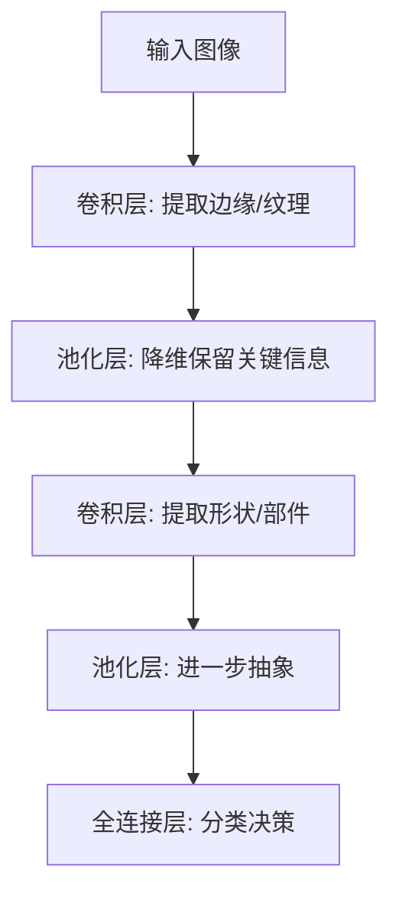

# 知识分享：用 AI 辅助学 AI —— 如何让大模型成为你的 24 小时私教

> **分享目标**：掌握用 ChatGPT/Claude 等 AI 工具加速 AI 学习的方法论，减少卡壳时间，提升学习效率  
> **目标受众**：正在学习 Python / 机器学习 / 深度学习的同学  
> **分享时长**：60-70 分钟（可分上下两场）  
> **前置知识**：无（面向 AI 学习者本身）

---
--- title: "测试笔记" publish: true tags: ["gitee显示"] ---
## 一、开场：为什么你需要"用 AI 学 AI"（3 分钟）

### 1.1 传统学习方式的痛点

| 痛点 | 你的经历 |
|------|---------|
| 代码报错看不懂 | 报错信息几十行，Google 搜不到 |
| 概念看了十遍还是模糊 | 教材讲得太抽象，没有直觉 |
| 一个问题卡半天 | 身边没有能问的人，论坛回复慢 |
| 学了后面忘了前面 | 笔记零散，知识没有串联 |
| 不知道学得对不对 | 没有人帮你检查理解是否有偏差 |

### 1.2 AI 作为学习工具的革命性

> **核心观点**：AI 不是来替代你学习的，而是来**消除学习过程中的摩擦阻力**——让你把精力集中在"理解"和"思考"上，而不是"找资料"和"排错"。

---

## 二、AI 知识拆解的底层方法论：五步拆解心法（12 分钟）

> **核心观点**：用 AI 做知识拆解，核心不在于"问"，而在于"结构化指令"和"迭代追问"。以下五步心法是经过大量实战验证的系统性方法。

### 心法概述

同一份材料，给专家看和给小白看，拆解维度完全不同。AI 辅助学习的本质，是**让 AI 按照你的认知水平，把复杂信息重新编码成好理解、好吸收的知识颗粒**。

> **元能力提示**：以下五步中，**迭代追问**是贯穿始终的元能力——如果任何一步的输出不满意，不要换问题，而是追问"能不能更具体/更简单/换个角度"。

| 步骤 | 核心动作 | 解决的问题 |
|------|---------|-----------|
| 第一步 | 定角色与受众 | "内容太浅或太深" |
| 第二步 | 结构力拆解 | "看完还是一团浆糊" |
| 第三步 | 费曼式转化 | "每个字都认识，连起来不懂" |
| 第四步 | 多维视角追问 | "不知道自己还有哪些盲区" |
| 第五步 | 图谱化输出 | "看完了记不住、找不到" |

---

### 第一步：定角色与受众（锚定颗粒度）

**核心**：同一份材料，必须先锁定"接收端"。

**技巧**：明确告知 AI "受众的前置知识水平"和"应用场景"。

**模板**：
```
假设你是一名资深培训师，请将[输入材料]拆解为面向刚入行的产品经理的入门指南，
避免使用专业黑话，重点讲清楚"是什么"和"为什么"。
```

**变式模板**：
```
假设我是【有 Python 基础但不懂深度学习】的学习者，请把【反向传播算法】
拆解成我能理解的版本。如果必须用数学公式，请先给出直觉解释，再补充公式。
```

---

### 第二步：结构力拆解（MECE 法则）

**核心**：强制 AI 遵循逻辑树原则，拒绝大段的"说明书式"输出。自上而下或由表及里地切分。

**技巧**：要求 AI 按因果关系、流程顺序、要素构成三种模型之一进行切分。

**模板**：
```
请使用 MECE 原则（相互独立，完全穷尽）拆解【Transformer 架构】。
将其分为 3 个一级模块，每个模块下再细分 2-3 个二级要点，
并以层级递进的逻辑排列（从基础到高阶 / 从现状到未来）。
```

**示例输出结构**：
```
Transformer 架构拆解
├── 1. 输入处理层
│   ├── 1.1 词嵌入（Token Embedding）
│   └── 1.2 位置编码（Positional Encoding）
├── 2. 注意力机制层
│   ├── 2.1 自注意力（Self-Attention）
│   ├── 2.2 多头注意力（Multi-Head Attention）
│   └── 2.3 掩码注意力（Masked Attention，仅解码器）
└── 3. 前馈与归一化层
    ├── 3.1 位置前馈网络（FFN）
    └── 3.2 残差连接 + LayerNorm
```

---

### 第三步：费曼式转化（降维打击）

**核心**：把晦涩定义强行翻译成"大白话"或"具象场景"。这是 AI 最擅长的"转译"能力。

**技巧**：强制 AI 使用类比法和举例子。如果仍有术语，要求"再降一个维度"。

**模板**：
```
针对上述拆解出的核心概念，请用生活中的常见事物（如做饭、开车、购物）
进行一对一类比。并针对每个抽象定义，补充一个极端具体的反面案例
（即"这不是什么"），帮助我规避理解误区。
```

**迭代追问技巧**：
```
你的解释里还有"梯度""参数空间"这些术语，我还是不太理解。
请把这部分再降一个维度，用完全没有数学背景的人也能听懂的话解释。
```

---

### 第四步：多维视角追问（打破盲区）

**核心**：单次拆解必有遗漏。利用 AI 的"多角色辩论"能力，对初步结果进行压力测试。

**技巧**：分别扮演"质疑者"、"补全者"和"执行者"审视框架。

**模板**：
```
请基于你刚才的拆解框架，切换以下三种视角进行补充：

杠精视角：这个框架最大的逻辑漏洞是什么？
补丁视角：最容易遗漏的隐形前提条件是什么？
落地视角：如果资源只有现在的 10%，必须先砍掉哪两个次要模块？
```

**实战技巧**：
- 杠精视角能暴露你理解的盲区
- 补丁视角能补充边界条件和假设
- 落地视角能帮你区分"必须懂"和"可以以后再看"

---

### 第五步：图谱化输出（可视化映射）

**核心**：文字拆解不利于记忆。强制 AI 转换成"可存储、可搜索"或"可视化"的结构。

**技巧**：要求特定格式输出，如 Markdown 代码块、Mermaid 流程图、表格矩阵。

**模板**：
```
请将最终的拆解结果整理为 Markdown 形式的思维导图（用于存储），
并用一句话总结出本知识点的第一性原理（即最底层的那个不可简化的基石）。
```

**输出示例**：
```markdown
## CNN 第一性原理
> "用局部感受野扫描图像，通过权重共享提取层次化特征"


```

---

### 进阶心法（高手与菜鸟的分水岭）

#### 心法 A：信源对冲法

不要只给一份材料。输入两篇观点相反的文章，让 AI 拆出"认知坐标轴"而非"死知识"。

**模板**：
```
请拆解 A 与 B 的核心分歧点，底层假设哪里不同？结论的有效边界在哪里？

【文章 A 核心观点】
（摘要）

【文章 B 核心观点】
（摘要）
```

#### 心法 B：输出测盲法

拆解完后，让 AI 出题检验你是否真懂——这是最佳学习闭环。

**模板**：
```
基于拆解框架给我出 5 道辨析题（比如"以下说法哪个符合该理论，哪个是偷换概念？"）。
先出题，我回答后你批改并解释。
```

#### 致命陷阱提醒

> AI 倾向于"平均化"答案，会为了逻辑平滑而删除反常数据和冲突观点。
>
> **解决方案**：在指令末尾加上——
> ```
> 请优先保留原文中的反常数据或冲突观点，不要为了平滑逻辑而删除它们。
> ```

---

> 掌握了五步拆解心法之后，接下来我们将它应用到 5 个最常见的 AI 学习场景中，每个场景都配有可直接复制使用的提示词模板。

## 三、五大核心场景 + 实战模板（25 分钟）

### 场景 1：概念理解 —— 把抽象变具体（5 分钟）

**问题**：教材讲"梯度下降"，看完公式还是不知道它在干什么。

**AI 解法**：用类比 + 分层解释

#### 提示词模板 1：概念类比

```
请用【生活化的类比】解释【梯度下降】这个概念。
要求：
1. 先给一个高中生能听懂的版本（不用公式）
2. 再给一个大学生级别的版本（引入公式和直觉）
3. 最后举一个深度学习中的具体例子
4. 指出最容易误解的地方
```

**示例输出**：
- 高中生版："就像蒙眼下山，每走一步用脚探一探哪边更低，就往哪边走"
- 大学生版："沿着损失函数负梯度方向更新参数..."
- 具体例子："训练神经网络时，权重一开始随机，梯度下降告诉它往哪个方向调整能让预测误差变小"
- 易错点："学习率太大就像步子迈太大直接跨过谷底，太小就像蜗牛爬"

#### 提示词模板 2：对比理解

```
请对比解释【CNN 的卷积层】和【全连接层】的区别。
格式要求：
- 用表格对比（作用、参数量、适用数据类型）
- 各举一个生活中的类比
- 指出如果混淆两者会导致什么问题
```

**实战技巧**：
- 如果 AI 的解释还是太抽象，继续追问："能不能用一个更具体的例子？"
- 要求 AI 画 ASCII 示意图或流程图（部分 AI 支持 Mermaid 语法）

---

### 场景 2：代码排错 —— 从报错到解决（5 分钟）

**问题**：运行 PyTorch 代码，遇到 `RuntimeError: Expected object of scalar type Float but got Double`。

**AI 解法**：直接丢报错 + 代码

#### 提示词模板 3：报错诊断

```
我的代码运行时报错了，请帮我分析原因并给出修复方案。

【报错信息】
RuntimeError: Expected object of scalar type Float but got Double

【相关代码】
import torch
x = torch.tensor([1.0, 2.0, 3.0])
...（贴出 surrounding 代码）

要求：
1. 解释这个错误的根本原因
2. 给出修复后的代码
3. 告诉我以后如何避免类似问题
```

**示例输出**：
- 原因：`torch.tensor` 默认根据输入数据推断类型，如果输入是 Python float 列表，可能创建为 Double
- 修复：显式指定 `dtype=torch.float32` 或调用 `.float()`
- 预防：养成显式声明数据类型的习惯

#### 提示词模板 4：代码审查

```
请审查我写的这段 PyTorch 训练代码，找出潜在问题和可优化的地方。

【代码】
（贴代码）

要求：
1. 标出【严重错误】（会导致训练失败或结果错误）
2. 标出【建议优化】（不影响运行但不够好）
3. 标出【风格问题】（PEP8、命名规范等）
4. 给出修改后的完整代码
```

**实战技巧**：
- 报错信息要贴完整，包括 Traceback 的最后一行和前面的上下文
- 如果 AI 给出的方案没用，继续追问："试了这个方法还是报错，新的错误是 XXX"
- 把解决过的问题整理成"踩坑卡"存入 Obsidian

---

### 场景 3：论文/教程速读 —— 提取核心信息（5 分钟）

**问题**：一篇 10 页的 Transformer 论文，看了两小时抓不住重点。

**AI 解法**：结构化摘要 + 递进式提问

#### 提示词模板 5：论文速读

```
请帮我总结这篇论文的核心内容。

【论文标题/摘要】
Attention Is All You Need
（或粘贴论文摘要/Introduction）

要求按以下格式输出：
1. 一句话概括：这篇论文解决了什么问题？
2. 核心方法：提出了什么新东西？（用通俗语言）
3. 关键结果：比前人方法好在哪里？
4. 对我的学习/工作有什么启发？
5. 如果我想复现，需要掌握哪些前置知识？
```

#### 提示词模板 6：教程拆解

```
请帮我拆解这个教程的学习路径，告诉我哪些是必须精读的，哪些可以跳过。

【教程内容】
（粘贴教程大纲或链接）

我的背景：
- 已掌握：Python 基础、NumPy
- 正在学：PyTorch
- 目标：2 周内能独立搭建 CNN 图像分类器

要求：
1. 标注每部分的优先级（必读/选读/跳过）
2. 指出可能的学习卡点
3. 推荐补充阅读资源
```

**实战技巧**：
- 不要直接丢 PDF，先复制摘要和 Conclusion 给 AI
- 追问"作者为什么要这样做？"比"作者做了什么？"更有价值
- 让 AI 用中文解释英文论文的核心思想，节省时间

---

### 场景 4：代码改写与跨语言迁移（4 分钟）

**问题**：找到了 TensorFlow 的代码示例，但你的项目用 PyTorch。

**AI 解法**：直接请求改写

#### 提示词模板 7：框架迁移

```
请将以下 TensorFlow/Keras 代码改写为 PyTorch 代码。

【原始代码】
（贴 TensorFlow 代码）

要求：
1. 保持逻辑完全一致
2. 使用 PyTorch 的标准写法（nn.Module + DataLoader）
3. 添加中文注释解释每一步
4. 指出两个框架在这个场景下的关键差异
```

#### 提示词模板 8：代码简化

```
请帮我简化这段代码，同时保持功能不变。

【原始代码】
（贴冗长代码）

要求：
1. 使用更 Pythonic 的写法（列表推导式、内置函数等）
2. 删除冗余代码
3. 解释每一处修改的原因
```

**实战技巧**：
- 改写后务必自己运行验证，AI 可能在 API 细节上出错
- 把常用的"TensorFlow ↔ PyTorch"对照表整理成笔记

---

### 场景 5：自测与面试模拟 —— 检验学习效果（4 分钟）

**问题**：学完了决策树，不知道自己掌握到什么程度。

**AI 解法**：生成题目 + 扮演考官

#### 提示词模板 9：知识点自测

```
请基于【决策树】这个主题，给我出 5 道测试题。

要求：
1. 2 道概念题（考察理解）
2. 2 道应用题（考察实战）
3. 1 道开放性思考题（考察深度）
4. 先出题，我回答后你再批改并解释
```

#### 提示词模板 10：面试模拟

```
请扮演一位机器学习算法工程师面试官，对我进行技术面试。

面试范围：CNN 卷积神经网络
难度：初级到中级
形式：你问一个问题，我回答，你给我反馈（对错 + 改进建议）

请开始第一个问题。
```

**实战技巧**：
- 让 AI 追问"为什么"，检验你是否真的理解还是只是背答案
- 把答不上来的问题标记为薄弱点，针对性复习

---

> 以上 5 个场景覆盖了日常学习的核心需求。如果你想让 AI 从"工具"升级为"学习搭档"，以下 3 个进阶技巧值得关注。

## 四、进阶技巧：让 AI 成为你的"学习搭档"（5 分钟）

### 4.1 苏格拉底式提问法

不要只问"是什么"，而是让 AI 引导你思考：

```
我想理解【反向传播】，但不想直接看答案。
请你用苏格拉底式提问法，通过一系列问题引导我逐步推导出反向传播的核心思想。
每问我一个问题，等我回答后再问下一个。
```

### 4.2 费曼学习法 + AI

```
我试着用简单的语言解释【Batch Normalization】：
"（你的解释）"

请判断我的理解是否正确。
如果有错误或不完整的地方，请指出并帮我修正。
然后给我出一个更准确的、适合给新手讲解的版本。
```

### 4.3 学习路径动态规划

```
我目前的学习状态：
- 已完成：Python 基础、NumPy/Pandas、机器学习 7 大算法
- 正在学：PyTorch + CNN
- 可用时间：每天 2 小时
- 目标：3 个月后能独立完成深度学习项目

请帮我制定一个具体的学习计划，包括：
1. 每周学习主题
2. 每个主题的推荐资源（教程/视频/项目）
3. 每周的产出目标（代码/笔记/博客）
4. 检验学习效果的 checkpoint
```

---

## 五、避坑指南：用 AI 学习的 5 个禁忌（5 分钟）

### 禁忌 1：直接复制代码，不自己敲一遍
- **后果**：眼高手低，面试时写不出来
- **正确做法**：AI 给代码 → 自己理解后默写 → 对比差异 → 整理到笔记

### 禁忌 2：把 AI 的答案当成绝对真理
- **后果**：AI 会"幻觉"—— confidently wrong（自信地犯错）
- **正确做法**：关键知识点交叉验证（查官方文档、看教材、跑代码验证）

### 禁忌 3：只输入"帮我解释一下 XXX"
- **后果**：得到泛泛而谈的答案，没有针对性
- **正确做法**：提供上下文（你的背景、已知什么、困惑点在哪）

### 禁忌 4：跳过基础，直接让 AI 帮你做项目
- **后果**：项目跑通了但不知道为什么，遇到新问题还是不会
- **正确做法**：AI 辅助理解，但核心逻辑必须自己掌握

### 禁忌 5：不做笔记，依赖每次重新问 AI
- **后果**：同样的问题反复问，学习效率低下
- **正确做法**：把 AI 的高质量回答整理进个人知识库（Obsidian/Notion）

---

> 工欲善其事，必先利其器。接下来搭建两套基础设施——笔记系统和知识库——让前面所有技巧产生的成果有地方沉淀和复用。

## 六、AI 学习基础设施搭建（8 分钟）

### 6.1 AI 学习笔记系统搭建 —— 用 Obsidian 构建可复用知识库

**问题**：笔记东一篇西一篇，学了就忘，复习时找不到。

**AI 解法**：Obsidian + 结构化模板 + AI 辅助整理

#### 笔记体系设计

```
AI知识库/
├── 概念卡/           ← 每个算法/概念一张卡片
│   ├── 梯度下降.md
│   └── 卷积神经网络.md
├── 代码卡/           ← 可复用代码片段
│   ├── PyTorch训练模板.md
│   └── sklearn模型评估.md
├── 踩坑卡/           ← 报错及解决方案
│   ├── RuntimeError-Float-Double.md
│   └── CUDA内存不足.md
├── 项目卡/           ← 完整项目记录
│   └── CIFAR10图像分类.md
└── 索引卡/           ← 知识地图
    └── 机器学习知识地图.md
```

#### 概念卡模板（AI 辅助生成）

```
请帮我整理一张【决策树】的概念卡，按以下格式：

# 决策树

## 一句话定义
（用一句话概括）

## 核心思想
（通俗解释）

## 关键公式/算法
（如有）

## 代码速查
（sklearn 调用示例）

## 易错点
（常见误区）

## 关联知识
（双向链接：[[信息增益]] [[基尼指数]] [[随机森林]]）

## 个人理解
（学完后用自己的话写）
```

**实战技巧**：
- 让 AI 把零散笔记自动整理成结构化卡片
- 用 Obsidian 的 Graph View 查看知识网络，发现盲区
- 每周让 AI 根据你的笔记生成"本周知识总结"

---

### 6.2 个人 AI 知识库搭建 —— 让 AI 记住你的专属信息

**问题**：每次问 AI 都要重复背景，AI 不记得你学过什么、卡在什么地方。

**AI 解法**：构建个人知识库，让 AI 基于你的笔记回答

#### 方案 A：Obsidian + AI 插件

使用 Obsidian 插件（如 Copilot、Smart Connections）：
- 把你的笔记作为上下文，问 AI 时自动引用相关知识
- 输入"我之前学过的 CNN 内容里，卷积和池化有什么区别？"，AI 自动检索你的笔记回答

#### 方案 B：ChatGPT Custom GPTs / Claude Projects

```
请基于以下我的学习笔记，回答我的问题：

【我的背景】
- 已完成：Python 基础、NumPy/Pandas、机器学习 7 大算法
- 正在学：PyTorch + CNN
- 薄弱点：反向传播的数学推导

【我的笔记】
（粘贴相关笔记内容）

【我的问题】
（具体问题）
```

#### 方案 C：本地 RAG 知识库（进阶）

使用开源工具（如 AnythingLLM、Dify、FastGPT）：
- 导入所有 PDF 教材、笔记、代码
- 本地部署大模型，实现"问你的知识库"
- 隐私安全，不上传云端

**提示词模板 11：基于个人知识库提问**

```
以下是我关于【CNN卷积神经网络】的学习笔记，请你基于这些内容回答我的问题，
如果笔记里没有相关内容，请告诉我"笔记中未涉及"，并补充通用知识。

【我的笔记】
（粘贴笔记内容）

【我的问题】
（具体问题）
```

---

> 基础设施搭好了，工具也熟悉了。最后一部分，我们跳出"具体场景"，从更高维度发散思维，看看还有哪些 AI 辅助学习的可能性。

## 七、更多 AI 辅助学习高阶技巧（扩散思维）（10 分钟）

### 7.1 把厚书变薄 —— AI 辅助知识压缩

**问题**：一本 500 页的教材，看了后面忘前面。

**AI 解法**：分层压缩 + 卡片化

```
请把以下章节内容压缩成 3 个层次：

【原始内容】
（粘贴教材章节）

要求：
1. 第一层：一句话核心（适合快速回顾）
2. 第二层：3-5 个要点（适合复习）
3. 第三层：详细解释 + 例子（适合深度学习）
4. 生成 5 道自测题检验压缩是否到位
```

**进阶玩法**：
- 让 AI 把整本书压缩成"知识地图"（Markdown 大纲）
- 用 AI 生成每章的"睡前 3 分钟回顾"卡片
- 把压缩后的内容做成 Anki 记忆卡片

---

### 7.2 视觉化学习 —— 让 AI 画思维导图和示意图

**问题**：纯文字笔记不够直观，难以理解复杂结构。

**AI 解法**：生成 Mermaid 图表、ASCII 图、甚至 prompts for AI 画图

```
请用 Mermaid 语法画出【Transformer 的编码器-解码器结构】。
要求：
1. 包含输入嵌入、位置编码、多头注意力、前馈网络
2. 标注数据流向
3. 用不同颜色区分编码器和解码器部分
```

**AI 生成后**：把 Mermaid 代码粘贴到 Obsidian（需插件）或 [Mermaid Live Editor](https://mermaid.live) 查看图形。

**更多视觉化技巧**：
- 让 AI 用 ASCII 画算法流程图（适合快速记录）
- 让 AI 生成 Stable Diffusion/Midjourney 提示词来画概念图
- 让 AI 把代码执行流程画成时序图

---

### 7.3 多模态学习 —— 用 AI 处理视频/播客/论文

**问题**：看视频教程太慢，听播客抓不住重点，读英文论文太费劲。

**AI 解法**：

| 场景 | 工具/方法 | 操作 |
|------|----------|------|
| 视频教程 | YouTube 字幕 + AI | 提取字幕 → AI 生成摘要和要点 |
| 播客/讲座 | 语音转文字 + AI | Whisper 转录 → AI 提取金句和知识点 |
| 英文论文 | AI 翻译 + 解读 | 粘贴摘要 → AI 中文解释 + 核心方法提取 |
| 长文档 | AI 分段摘要 | 每章单独摘要 → 整体串联 |

```
以下是一段视频教程的字幕，请帮我：
1. 提取核心知识点（按时间戳）
2. 生成一个结构化大纲
3. 标记我需要注意的重点和易错点
4. 生成 3 道自测题

【字幕内容】
（粘贴字幕）
```

---

### 7.4 间隔重复 + AI —— 智能复习系统

**问题**：学了就忘，不知道什么时候该复习。

**AI 解法**：基于遗忘曲线的智能复习

```
以下是我本周学习的新知识，请帮我设计一个间隔复习计划：

【本周学习内容】
1. CNN 的卷积和池化操作
2. PyTorch 的 nn.Module 使用
3. 交叉熵损失函数

要求：
1. 按艾宾浩斯遗忘曲线安排复习时间点（第 1/2/4/7/15 天）
2. 每次复习提供不同的检验方式（概念题/代码题/应用题）
3. 如果某知识点掌握不好，增加复习频次
```

**工具推荐**：
- 把 AI 生成的复习内容导入 Anki/RemNote
- 用 Notion 数据库跟踪复习进度
- 让 AI 每次生成不同的题目，避免机械记忆

---

### 7.5 代码可视化 —— 让 AI 解释代码执行流程

**问题**：代码能跑通，但不清楚每一步发生了什么。

**AI 解法**：逐行解释 + 执行追踪

```
请逐行解释以下代码的执行过程，模拟每一行执行后变量的值：

【代码】
import torch
x = torch.tensor([[1.0, 2.0], [3.0, 4.0]])
w = torch.tensor([[0.5], [0.5]], requires_grad=True)
y = torch.matmul(x, w)
loss = y.sum()
loss.backward()

要求：
1. 用表格展示每行执行后的变量形状和值
2. 解释 backward() 时梯度是如何传播的
3. 画出计算图（Computation Graph）
```

---

### 7.6 对比学习法 —— 用 AI 生成"平行宇宙"版本

**问题**：只学了一种实现方式，遇到变体就懵。

**AI 解法**：让 AI 生成同一问题的多种解法，对比学习

```
请用 3 种不同的方法实现【图像分类】任务，并对比它们的优缺点：

要求：
1. 方法 A：传统机器学习（用 sklearn 的 SVM/随机森林 + 手工特征）
2. 方法 B：浅层神经网络（PyTorch 全连接网络）
3. 方法 C：深度 CNN（ResNet 微调）

每种方法给出：
- 适用场景
- 代码框架（关键部分）
- 优缺点
- 性能预期
```

**进阶玩法**：
- "如果数据集从 1000 张变成 100 万张，方案应该怎么变？"
- "如果没有 GPU，怎么在 CPU 上优化这个模型？"
- "如果要求推理速度 < 10ms，应该选哪个方案？"

---

### 7.7 错题本自动化 —— AI 分析你的薄弱环节

**问题**：做了很多题，但不知道哪里薄弱。

**AI 解法**：智能错题分析

```
以下是我最近练习中的错题，请帮我分析薄弱环节：

【错题记录】
1. 题目：关于 BatchNorm 的作用 → 我的答案：加速训练 → 正确答案：稳定分布 + 加速训练 + 正则化
2. 题目：L1 和 L2 正则化的区别 → 我的答案：都防止过拟合 → 漏答：L1 产生稀疏解
3. ...

要求：
1. 归纳我的知识盲区（按主题分类）
2. 分析错误模式（概念不清？细节遗漏？理解偏差？）
3. 给出针对性复习建议
4. 生成 5 道同类变式题让我巩固
```

---

### 7.8 学习打卡与复盘 —— AI 学习教练

**问题**：学习计划难以坚持，缺乏反馈。

**AI 解法**：AI 作为 accountability partner（ accountability 伙伴）

**每日打卡模板**：

```
今天的学习打卡：
- 学习时间：2 小时
- 学习主题：CNN 的池化操作
- 完成内容：读完教材第 4 章 + 跑通 LeNet 代码
- 遇到的问题：MaxPool 和 AvgPool 的选择不确定
- 明日计划：学习经典 CNN 架构（AlexNet/VGG/ResNet）

请帮我：
1. 评价今天的学习质量
2. 解答我遇到的问题
3. 调整明天的学习计划（如果发现今天的内容没吃透）
4. 给我一句鼓励的话
```

**周复盘模板**：

```
本周学习总结：
- 总学习时长：12 小时
- 完成主题：CNN 基础（卷积、池化、经典架构）
- 代码实践：CIFAR-10 图像分类（准确率 57%→93%）
- 笔记产出：5 张概念卡 + 3 张踩坑卡

请帮我：
1. 生成本周学习报告（成就 + 不足）
2. 对比上周是否有进步
3. 指出下一周需要重点突破的方向
4. 生成下周学习计划草案
```

---

### 7.9 跨学科联结 —— 用 AI 发现知识间的隐藏联系

**问题**：知识孤岛，学 CNN 时想不起线性代数，学优化时想不起微积分。

**AI 解法**：主动建立知识联结

```
我正在学习【CNN 卷积操作】，请帮我建立它与以下前置知识的联系：

1. 线性代数：卷积和矩阵乘法的关系是什么？
2. 信号处理：卷积核和滤波器的关系？
3. 概率统计：特征图上的池化操作和采样的关系？
4. 计算机视觉：传统图像处理中的边缘检测算子（Sobel/Laplacian）与卷积核的关系？

要求：
- 每个联结给出直观的解释
- 如果有数学关系，给出公式
- 指出理解这个联结对深度学习有什么帮助
```

**进阶玩法**：
- "学决策树时，它和数据库的索引结构有什么相似之处？"
- "神经网络的激活函数和生物学中神经元的阈值激发有什么对应？"
- "反向传播和控制系统中的反馈调节有什么共通之处？"

---

### 7.10 实战项目孵化 —— 从想法到 MVP

**问题**：学了很多理论，但不知道做什么项目。

**AI 解法**：AI 帮你 brainstorm + 规划 + 分解任务

**Step 1：项目选题**

```
我的背景：
- 已掌握：Python、sklearn、PyTorch、CNN
- 兴趣方向：计算机视觉
- 可用时间：2 周（每天 2 小时）
- 目标：做出一个能写在简历上的项目

请帮我 brainstorm 5 个项目想法，要求：
1. 数据集容易获取（Kaggle/UCI/公开数据集）
2. 难度适中（2 周内可完成 MVP）
3. 能展示我已学的技术栈
4. 有实际应用场景，不只是 toy project
```

**Step 2：项目规划**

```
我决定做【猫狗图像分类器】项目，请帮我制定详细执行计划：

要求：
1. 按天分解任务（Day 1-14）
2. 每天给出具体的产出物和验收标准
3. 标注可能遇到的卡点
4. 提供相关代码模板和数据集链接
```

**Step 3：代码脚手架**

```
请帮我生成【猫狗图像分类】项目的初始代码框架，包含：
1. 项目目录结构
2. 数据加载模块（使用 torchvision.datasets）
3. 模型定义（ResNet18 微调）
4. 训练循环（含早停和模型保存）
5. 评估脚本（准确率、混淆矩阵）
6. 预测脚本（单张图片推理）

要求代码完整、可运行，添加中文注释。
```

---

## 八、收尾：建立你的"AI 学习工作流"（2 分钟）

### 推荐的最小可行工作流

```
学习新概念
  → 用"类比模板"让 AI 讲清楚
  → 自己复述一遍，用"费曼模板"检验
  → 整理成概念卡存入 Obsidian
  → 用"知识压缩模板"生成多层摘要

写代码 / 调试
  → 卡住 10 分钟再求助 AI
  → 用"报错模板"或"审查模板"
  → 用"代码可视化模板"理解执行流程
  → 解决后整理成"踩坑卡"

读论文 / 教程 / 视频
  → 用"速读模板"抓核心
  → 用"教程拆解模板"排优先级
  → 用"多模态模板"处理视频/播客
  → 把关键洞察加入知识网络

笔记整理 / 复习
  → 用"概念卡模板"结构化笔记
  → 用"个人知识库模板"让 AI 基于笔记回答
  → 用"间隔重复模板"安排复习
  → 用"错题分析模板"定位薄弱点

检验学习效果
  → 用"自测模板"每周检验
  → 用"面试模板"模拟实战
  → 用"对比学习模板"掌握多种解法
  → 用"项目孵化模板"做实战项目

复盘与迭代
  → 用"学习打卡模板"每日复盘
  → 用"周复盘模板"调整计划
  → 用"跨学科联结模板"打通知识网络
```

### 核心心法

> **"AI 是教练，不是替身。"**
>
> 最好的学习方式是：你先尝试 → 遇到困难 → AI 给提示 → 你自己完成 → AI 帮你复盘。
> 而不是：你直接让 AI 完成。
>
> **"笔记是资产，不是负担。"**
>
> 把 AI 生成的高质量内容整理进个人知识库，让它成为你的第二大脑。

---

## 附录：提示词模板速查表（完整版）

| 场景 | 模板名称 | 核心要点 |
|------|---------|---------|
| **方法论** | **定角色与受众** | 前置知识 + 应用场景 + 避免黑话 |
| **方法论** | **MECE 结构拆解** | 3 级模块 + 层级递进 + 完全穷尽 |
| **方法论** | **费曼式转化** | 生活类比 + 反面案例 + 降维追问 |
| **方法论** | **多维视角追问** | 杠精/补丁/落地三种视角压力测试 |
| **方法论** | **图谱化输出** | Markdown 思维导图 + 第一性原理总结 |
| 概念理解 | 概念类比 | 高中版 + 大学版 + 具体例子 + 易错点 |
| 概念理解 | 对比理解 | 表格对比 + 生活类比 + 混淆风险 |
| 代码排错 | 报错诊断 | 报错信息 + 相关代码 + 根因 + 修复 + 预防 |
| 代码排错 | 代码审查 | 严重错误 + 建议优化 + 风格问题 + 完整修改版 |
| 论文速读 | 论文速读 | 一句话概括 + 核心方法 + 关键结果 + 启发 + 前置知识 |
| 教程拆解 | 教程拆解 | 必读/选读/跳过 + 卡点预警 + 补充资源 |
| 代码改写 | 框架迁移 | 逻辑一致 + 标准写法 + 中文注释 + 差异说明 |
| 代码改写 | 代码简化 | Pythonic 写法 + 删除冗余 + 解释修改 |
| 自测检验 | 知识点自测 | 概念题 + 应用题 + 思考题 + 先答后批 |
| 面试准备 | 面试模拟 | 设定角色 + 范围 + 难度 + 问答式互动 |
| 笔记整理 | 概念卡生成 | 定义 + 思想 + 公式 + 代码 + 易错点 + 关联知识 |
| 知识库 | 个人知识库提问 | 笔记内容 + 基于笔记回答 + 补充通用知识 |
| 知识压缩 | 厚书变薄 | 一句话核心 + 要点 + 详细解释 + 自测题 |
| 视觉化 | Mermaid 图表 | 结构图 + 数据流向 + 颜色区分 |
| 多模态 | 视频/播客摘要 | 时间戳 + 大纲 + 重点 + 自测题 |
| 复习 | 间隔重复计划 | 艾宾浩斯曲线 + 不同题型 + 动态调整 |
| 代码理解 | 代码可视化 | 逐行解释 + 变量追踪 + 计算图 |
| 对比学习 | 平行宇宙版本 | 多种解法 + 适用场景 + 优缺点 + 变式问题 |
| 错题分析 | 薄弱点诊断 | 知识盲区 + 错误模式 + 复习建议 + 变式题 |
| 复盘 | 学习打卡 | 学习记录 + 质量评价 + 问题解答 + 计划调整 |
| 复盘 | 周复盘 | 成就/不足 + 进度对比 + 突破方向 + 下周计划 |
| 联结 | 跨学科联结 | 前置知识关联 + 直观解释 + 数学公式 + 学习帮助 |
| 项目 | 项目孵化 | Brainstorm + 任务分解 + 卡点预警 + 代码脚手架 |
| **方法论** | **信源对冲** | 两篇相反观点 + 核心分歧 + 有效边界 |
| **方法论** | **输出测盲** | 基于拆解框架出辨析题 + 先答后批改 |

---

> **维护说明**：本分享材料可随学习进度更新。每掌握一个新工具或方法，可在相应章节中补充新的提示词模板。
>
> **当前版本**：v3.0（新增：五步拆解心法底层方法论、笔记系统搭建、个人知识库、10 个扩散思维高阶技巧）
>
> **总模板数**：28 个覆盖全学习流程的提示词模板（含 7 个方法论模板 + 21 个场景模板）
